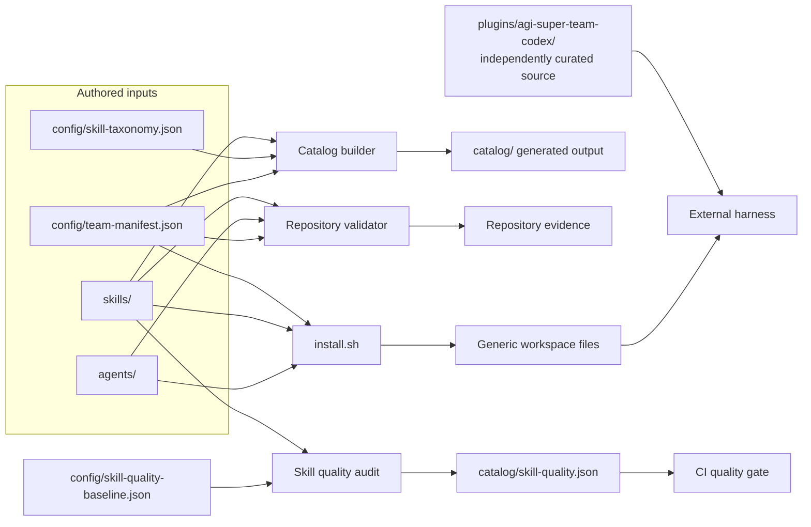

# 🗺️ Repository architecture

AGI Super Team is a versioned content repository with safe packaging and discovery tooling. It is not an agent runtime.

Start with the shared [repository context](./CONTEXT.md). The machine-readable ownership contract is [`config/repository-architecture.json`](./config/repository-architecture.json), and consequential choices are recorded in [`docs/adr/`](./docs/adr/).

## The five layers

| Layer | Authored source | Consumer | Contract |
|---|---|---|---|
| Reusable instructions | `skills/*/SKILL.md` | Catalog, Agents, distributions | Tracked physical entrypoint; no symlink |
| Team composition | `agents/`, `starter-kits/`, `config/team-manifest.json` | Generic installer and docs | Manifest is roster and kit authority |
| Distribution | `.codex/`, plugin manifests, `plugins/agi-super-team-codex/` | External harnesses | Presence is not compatibility evidence |
| Verification evidence | `scripts/`, `tests/`, CI | Maintainers and release gates | Structural checks do not imply runtime outcomes |
| Discovery and navigation | `catalog/`, `docs/`, README indexes | Humans, search, coding agents | Generated files never become source authority |



## Sources of truth

- Team and kit membership: [`config/team-manifest.json`](./config/team-manifest.json)
- Skill category and candidate risk signals: [`config/skill-taxonomy.json`](./config/skill-taxonomy.json)
- Reviewed classification labels and fixed sample membership: [`config/skill-taxonomy-gold.json`](./config/skill-taxonomy-gold.json)
- Canonical physical skill inventory: tracked `skills/*/SKILL.md` files interpreted by [`scripts/repository_model.py`](./scripts/repository_model.py)
- Removed machine-local link tombstones: [`config/external-skill-sources.json`](./config/external-skill-sources.json); nullable source fields are not provenance
- Generated catalog: [`catalog/`](./catalog/) is an output, never a source

README counts, badges, plugin manifests, and generated JSON must not override these authorities.

## Module classification

| Module | Interface | Implementation | Depth / leverage |
|---|---|---|---|
| Canonical skill library | tracked physical `skills/<id>/SKILL.md` | `skills/` | Foundational; consumed by every pack and catalog |
| Team composition | `config/team-manifest.json` | `agents/`, `starter-kits/` | Composed; one roster drives installer and validation |
| Safe installation | `./install.sh … <kit-or-agent>` | `install.sh`, installer fixtures | Composed; one safety boundary protects every deployment |
| Catalog discovery | taxonomy + fixed reviewed labels in; Markdown/JSON index + agreement report out | taxonomy, Gold Set, builders, `catalog/` | Composed; one rule set serves human and machine discovery with a separate semantic regression contract |
| Distribution Adapters | harness manifests and curated packages | `.codex/`, plugin manifests, `plugins/` | Boundary; isolates harness conventions from canonical content |
| Verification evidence | `npm test`, `npm run validate:strict` | `scripts/`, `tests/`, CI | Foundational; prevents drift across public surfaces |
| Public navigation | README routes and maintained Pages | README files, `docs/`, `cookbook/`, `assets/` | Boundary; keeps copied claims out of source authority |
| Governance memory | context, architecture, ADRs | `CONTEXT.md`, this file, `docs/adr/` | Foundational; preserves language and decisions |

The registry also records each primary path role: `authored-authority`, `authored-source`, `generated-output`, `distribution-adapter`, `implementation`, `evidence`, `public-navigation`, or `governance`.

## Important seams and Adapters

- `team-manifest portability class → install.sh selection → workspace Skills + generated TOOLS.md` is the generic-install Seam; only `required` and `optional` cross it.
- `team-manifest assignments → catalog builder → skill-index assignments + portability_class` is the human/machine classification Seam.
- `skill-taxonomy → catalog builder → catalog/` is a generated discovery Seam.
- `fixed Gold labels + generated skill index → taxonomy evaluator → reviewed-set agreement report` is a semantic-regression Seam. It measures label agreement, not runtime quality.
- Root full-library harness manifests are legacy or manifest-only Adapters.
- `plugins/agi-super-team-codex/` is an independently curated Codex Adapter; it remains manifest-only until a matching client receipt exists.
- `CHARTER.md` and `COLLABORATION.md` are required shared generic-workspace inputs. Installed role packs use relative links to them.

## Public entry points

```text
README.md
├── setup.md                         generic preview and apply
├── .codex/INDEX.md                  curated Codex distribution
├── starter-kits/README.md           choose an outcome
├── skills/README.md                 support, portability, and discovery
│   └── catalog/README.md            complete generated inventory
├── agents/README.md                 generic role packs
├── cookbook/README.md               long-form references
└── docs/guides/index.html           maintained editorial guides
```

Legacy root documents may remain as stable routing paths. They must not duplicate current install commands or inventory facts.

## Deletion tests

| Remove | Expected impact | Architectural conclusion |
|---|---|---|
| `config/team-manifest.json` | Installer, catalog usage, and validator must fail before writes | High-Depth authority Interface |
| `config/skill-taxonomy.json` | Catalog build/check must fail | Authored classification authority |
| `config/skill-taxonomy-gold.json` | Semantic evaluation must fail closed | Reviewed, fixed-membership evaluation authority |
| `catalog/` | `npm run build:skills` recreates discovery outputs; `npm run build:skill-quality` recreates the quality report | Generated outputs, never authority |
| One distribution Adapter | Only that harness surface is lost | Adapter boundary is local |
| `CHARTER.md` or `COLLABORATION.md` | Installer preflight must fail with zero writes | Required shared installation Seam |
| A runtime receipt | Source content stays valid but `Verified` disappears | Evidence is not source truth |

## Change map

| When changing | Update | Verify |
|---|---|---|
| Agent or kit membership | `config/team-manifest.json`, referenced Agent files | `npm run validate -- --warnings-as-errors` |
| Skill metadata or taxonomy | Skill `SKILL.md`, taxonomy, and reviewed label only when its source changed | `npm run check:skills`, `npm run check:skill-quality`, and `npm run check:taxonomy-evaluation` |
| Generic installer behavior | `install.sh` and installer fixtures | `npm run test:installer` |
| Curated Codex package | `plugins/agi-super-team-codex/` and its index | Repository tests plus client receipt when available |
| Site data or SEO | `docs/`, data builder, site contracts | `npm run test:repository` |
| Repository boundary or path role | architecture registry, context, relevant ADR | `npm run check:architecture` |

## Contract score boundary

`npm run check:architecture` measures automated architecture-classification contracts: path ownership, authority separation, generated lineage, Adapter status, navigation, decision memory, and taxonomy debt ceilings. `npm run check:taxonomy-evaluation` separately measures agreement with the fixed reviewed Gold Set. Neither score proves Skill quality, safety, clean harness installs, fixture outcomes, or external beta evidence.

## Current deepening candidates

1. Validated repository configuration Module
2. Installer deployment-plan Module
3. Distribution inventory Module
4. Skill evidence and review Module
5. Guide publication Module

These are exploration candidates, not approved interfaces. The current low-risk priority is clearer ownership, deterministic evidence, and characterization tests before structural movement.
