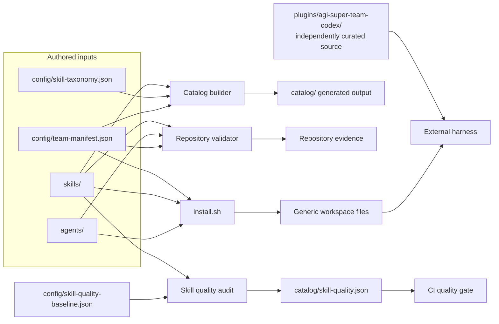

# 🗺️ Repository architecture

AGI Super Team is a versioned content repository with safe packaging and discovery tooling. It is not an agent runtime.

## The four layers

| Layer | Authored source | Consumer | Contract |
|---|---|---|---|
| Reusable instructions | `skills/*/SKILL.md` | Catalog, Agents, distributions | Tracked physical entrypoint; no symlink |
| Team composition | `agents/`, `starter-kits/`, `config/team-manifest.json` | Generic installer and docs | Manifest is roster and kit authority |
| Distribution | `.codex/`, plugin manifests, `plugins/agi-super-team-codex/` | External harnesses | Presence is not compatibility evidence |
| Evidence and discovery | `scripts/`, `tests/`, `docs/data/` | CI, catalog, Pages | Generated files never become source authority |



## Sources of truth

- Team and kit membership: [`config/team-manifest.json`](./config/team-manifest.json)
- Skill category and candidate risk signals: [`config/skill-taxonomy.json`](./config/skill-taxonomy.json)
- Canonical physical skill inventory: tracked `skills/*/SKILL.md` files interpreted by [`scripts/repository_model.py`](./scripts/repository_model.py)
- Removed machine-local links and provenance: [`config/external-skill-sources.json`](./config/external-skill-sources.json)
- Generated catalog: [`catalog/`](./catalog/) is an output, never a source

README counts, badges, plugin manifests, and generated JSON must not override these authorities.

## Public entry points

```text
README.md
├── setup.md                         generic preview and apply
├── .codex/INDEX.md                  curated Codex distribution
├── starter-kits/README.md           choose an outcome
├── skills/README.md                 support levels and discovery
│   └── catalog/README.md            complete generated inventory
├── agents/README.md                 generic role packs
├── cookbook/README.md               long-form references
└── docs/guides/index.html           maintained editorial guides
```

Legacy root documents may remain as stable routing paths. They must not duplicate current install commands or inventory facts.

## Change map

| When changing | Update | Verify |
|---|---|---|
| Agent or kit membership | `config/team-manifest.json`, referenced Agent files | `npm run validate -- --warnings-as-errors` |
| Skill metadata or taxonomy | Skill `SKILL.md`, taxonomy if needed | `npm run check:skills` and `npm run check:skill-quality` |
| Generic installer behavior | `install.sh` and installer fixtures | `npm run test:installer` |
| Curated Codex package | `plugins/agi-super-team-codex/` and its index | Repository tests plus client receipt when available |
| Site data or SEO | `docs/`, data builder, site contracts | `npm run test:repository` |

## Current deepening candidates

1. Validated repository configuration Module
2. Installer deployment-plan Module
3. Distribution inventory Module
4. Skill evidence and review Module
5. Guide publication Module

These are exploration candidates, not approved interfaces. The current low-risk priority is clearer ownership, deterministic evidence, and characterization tests before structural movement.
