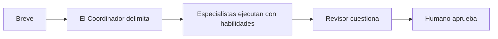
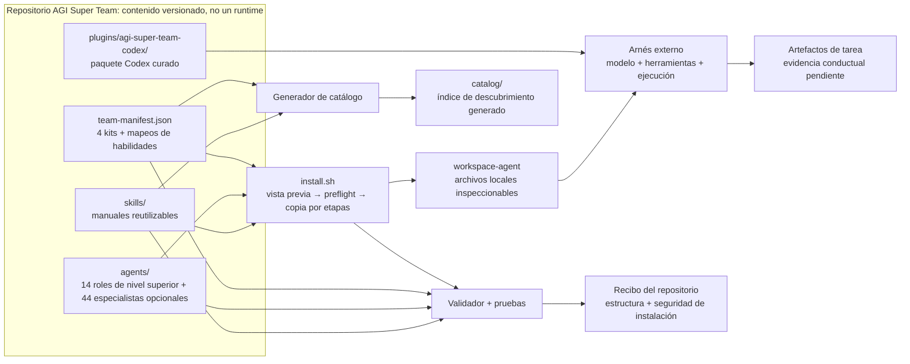

<p align="right"><a href="./README_CN.md">中文</a></p>

<p align="center">
  
</p>

<h1 align="center">AGI Super Team</h1>

<p align="center"><strong>Habilidades componibles para agentes especialistas y flujos de trabajo de equipo revisables.</strong></p>

<p align="center">
  Usa un único breve para estructurar trabajo con alcance definido, tareas especializadas, revisión independiente y una puerta de aprobación humana explícita.
</p>

AGI Super Team es una biblioteca versionada de **habilidades de agentes de IA, paquetes de roles especialistas y flujos de trabajo de equipo con intervención humana** para Codex y espacios de trabajo de agentes de codificación locales.

## Instalar para tu cliente de IA

Lista los 18 objetivos de adaptador, previsualiza uno y luego aplica la misma selección:

```bash
npx -y github:aAAaqwq/AGI-Super-Team --list-tools
npx -y github:aAAaqwq/AGI-Super-Team --tool claude-code
npx -y github:aAAaqwq/AGI-Super-Team --tool claude-code --install
npx -y github:aAAaqwq/AGI-Super-Team --tool claude-code --doctor
```

Reemplaza `claude-code` con un ID de `--list-tools`. Usa `--all-tools` solo cuando quieras intencionalmente cada adaptador global y de proyecto. Una ejecución sin argumentos permanece como la vista previa heredada de Codex; la nueva automatización debe especificar siempre `--tool` o `--all-tools`.

### Puntos de inicio recomendados

| Plataforma | Comando de vista previa | Capacidad instalada |
|---|---|---|
| **Claude Code** | `npx -y github:aAAaqwq/AGI-Super-Team --tool claude-code` | Agentes nativos Markdown + Habilidades nativas |
| **Codex** | `npx -y github:aAAaqwq/AGI-Super-Team --tool codex` | Agentes nativos TOML + Habilidades del plugin Codex; el adaptador actualmente verificado en tiempo de ejecución |
| **OpenClaw** | `npx -y github:aAAaqwq/AGI-Super-Team --tool openclaw` | Espacios de trabajo nativos de Agentes + Habilidades nativas |
| **Hermes Agent** | `npx -y github:aAAaqwq/AGI-Super-Team --tool hermes` | Habilidades nativas; los paquetes de roles se exponen como Habilidades en lugar de Agentes nativos |

Para OpenClaw, el instalador materializa los espacios de trabajo de Agentes pero no los registra; revisa y registra los espacios de trabajo deseados explícitamente después de la instalación.

### Instalar grupos de subagentes ejecutivos

El predeterminado siguen siendo los 14 roles de nivel superior. Agrega una pirámide ejecutiva, o los 44 especialistas opcionales:

```bash
npx -y github:aAAaqwq/AGI-Super-Team --tool codex --with-subagents cto
npx -y github:aAAaqwq/AGI-Super-Team --tool codex --with-subagents cpo --with-subagents cco
npx -y github:aAAaqwq/AGI-Super-Team --tool codex --all-subagents --install
```

La jerarquía es CEO → CTO/CPO/CCO → especialistas hoja. El CTO también referencia al PE canónico existente como líder de entrega; no crea una segunda identidad PE. Los 44 archivos fuente bajo `agents/*/subagents/*/AGENTS.md` son copias byte a byte desde `jnMetaCode/agency-agents-zh` fijado; el enrutamiento local y los contenedores de seguridad permanecen separados. Consulta `config/agent-sources.lock.json` para las URLs de origen y los dígitos SHA-256. El enrutamiento anidado de Codex requiere `max_depth = 2`; con cuatro hilos, ejecuta un gerente más como máximo dos hijos por oleada.

Estos son **18 objetivos de adaptador de cliente/runtime de IA**, no 18 CLIs intercambiables. Un adaptador puede instalar Agentes nativos, Habilidades nativas, reglas/contexto de proyecto, o paquetes de roles degradados a Agente-como-Habilidad. La colocación de archivos por sí sola no demuestra que un cliente actual haya cargado o ejecutado el contenido.

### Todos los 18 objetivos de adaptador

Las rutas para adaptadores globales son relativas al home seleccionado; los adaptadores de proyecto son relativos al directorio de proyecto seleccionado.

| ID | Cliente/runtime | Ámbito | Entrega de Agente | Entrega de Habilidad | Estado |
|---|---|---|---|---|---|
| `claude-code` | Claude Code | Global | Agente nativo Markdown: `.claude/agents` | Nativo: `.claude/skills` | Adaptador nativo |
| `codex` | Codex | Global | Agente nativo TOML: `.codex/agents` | Plugin nativo: `.codex/skills` | Adaptador verificado en tiempo de ejecución |
| `openclaw` | OpenClaw | Global | Espacio de trabajo nativo: `.openclaw/agency-agents` | Nativo: `.openclaw/skills/agi-super-team` | Adaptador nativo |
| `hermes` | Hermes Agent | Global | Agente-como-Habilidad: `.hermes/skills/agi-super-team-agents` | Nativo: `.hermes/skills/agi-super-team` | Habilidades nativas |
| `copilot` | GitHub Copilot | Global | Agente Markdown: `.github/agents`, `.copilot/agents` | Nativo: `.copilot/skills` | Adaptador |
| `antigravity` | Antigravity | Global | Agente: `.gemini/config/agents` | Nativo: `.gemini/config/skills` | **Experimental** |
| `gemini-cli` | Gemini CLI | Global | Agente Markdown: `.gemini/agents` | Nativo: `.gemini/skills` | Adaptador |
| `opencode` | OpenCode | Global | Agente Markdown: `.config/opencode/agents` | Nativo: `.config/opencode/skills` | Adaptador |
| `cursor` | Cursor | Global | Agente Markdown: `.cursor/agents` | Nativo: `.cursor/skills` | **Experimental** |
| `trae` | Trae | Proyecto | Regla de proyecto: `.trae/rules` | Nativo: `.trae/skills` | Adaptador de proyecto |
| `aider` | Aider | Proyecto | Reglas de proyecto combinadas: `CONVENTIONS.md` | Combinado en el mismo contexto de proyecto | Adaptador de proyecto |
| `windsurf` | Windsurf | Proyecto | Reglas de proyecto combinadas: `.windsurfrules` | Combinado en el mismo contexto de proyecto | Adaptador de proyecto |
| `qwen` | Qwen Code | Global | Agente Markdown: `.qwen/agents` | Nativo: `.qwen/skills` | Adaptador |
| `deerflow` | DeerFlow | Proyecto | Agente-como-Habilidad: `skills/custom/agi-super-team-agents` | Nativo: `skills/custom/agi-super-team` | Adaptador de proyecto |
| `workbuddy` | WorkBuddy | Global | Agente-como-Habilidad: `.workbuddy/skills/agi-super-team-agents` | Nativo: `.workbuddy/skills/agi-super-team` | Adaptador |
| `codewhale` | CodeWhale | Global | Agente-como-Habilidad: `.codewhale/skills/agi-super-team-agents` | Nativo: `.codewhale/skills/agi-super-team` | Adaptador |
| `kiro` | Kiro | Global | Agente Markdown: `.kiro/agents` | Nativo: `.kiro/skills` | Adaptador |
| `qoder` | Qoder | Global | Agente Markdown: `.qoder/agents` | Nativo: `.qoder/skills` | Adaptador |

La matriz describe el contrato del adaptador en `config/cli-adapters.json`, no una afirmación de que los 18 clientes hayan sido verificados en tiempo de ejecución. Cursor y Antigravity son explícitamente experimentales.

### Seleccionar destinos, actualizar y verificar

Usa `--home` para redirigir objetivos globales y `--project-dir` para objetivos con ámbito de proyecto (el directorio de proyecto predeterminado es el directorio actual). Esto facilita una auditoría desechable:

```bash
AGI_AUDIT_HOME="$(mktemp -d "${TMPDIR:-/tmp}/agi-super-team-home.XXXXXX")"
AGI_AUDIT_PROJECT="$(mktemp -d "${TMPDIR:-/tmp}/agi-super-team-project.XXXXXX")"

npx -y github:aAAaqwq/AGI-Super-Team --tool openclaw \
  --home "$AGI_AUDIT_HOME" --project-dir "$AGI_AUDIT_PROJECT"
npx -y github:aAAaqwq/AGI-Super-Team --tool openclaw \
  --home "$AGI_AUDIT_HOME" --project-dir "$AGI_AUDIT_PROJECT" --install
npx -y github:aAAaqwq/AGI-Super-Team --tool openclaw \
  --home "$AGI_AUDIT_HOME" --project-dir "$AGI_AUDIT_PROJECT" --doctor
```

Ejecuta el mismo comando `--install` nuevamente para actualizar el contenido gestionado; repite `--doctor` después. Reinicia o abre una nueva tarea en el cliente objetivo, luego verifica que descubra la superficie de Agente/Habilidad esperada. `--doctor` verifica los artefactos del adaptador instalados, no el comportamiento del modelo o la calidad de la tarea.

### Seguridad y límites de actualización

- La vista previa es la opción predeterminada y no realiza escrituras; `--install` es el límite de escritura explícito.
- Volver a aplicar la misma selección está diseñado para ser idempotente. Los destinos gestionados diferentes se respaldan antes del reemplazo; los archivos del cliente no relacionados están fuera de la selección gestionada.
- Los respaldos son ayudas de recuperación local, no una instantánea completa ni un sistema de desinstalación. Revisa la vista previa y mantén tu propio respaldo de control de versiones o sistema de archivos para configuraciones importantes.
- Se rechazan destinos con enlaces simbólicos o inseguros. `--no-agents` y `--no-skills` pueden reducir la carga cuando sea necesario.
- Este proyecto no utiliza un instalador basado en tuberías de scripts remotos; los comandos anteriores usan el ejecutor de paquetes de npm y aún merecen una revisión normal de dependencias.
- La instalación solo demuestra la materialización de archivos. Excepto para el adaptador marcado explícitamente como verificado en tiempo de ejecución, la carga y ejecución por parte del cliente actual permanecen sin verificar hasta que sean respaldadas por un recibo coincidente con el commit.

El diseño del adaptador se inspiró en parte en `jnMetaCode/agency-agents-zh` en el commit fijo `2ecfabf8`. El manifiesto de AGI Super Team, el mapeo de carga, el comportamiento de seguridad y los límites de evidencia se mantienen aquí.

<p align="center">
  <a href="#instalar-para-tu-cliente-de-ia"><strong>Instalar para un cliente</strong></a>&nbsp;&nbsp;|&nbsp;&nbsp;
  <a href="./.codex/INDEX.md">Inspeccionar el paquete Codex</a>
</p>

## 🧠 El sistema en un minuto

| Capa | Lo que obtienes | Por qué importa |
|---|---|---|
| **🧩 Habilidades** | Archivos físicos canónicos `SKILL.md` agrupados en 14 categorías de resultados | Reutiliza manuales de procedimientos enfocados en lugar de reconstruir instrucciones para cada tarea |
| **🤖 Agentes** | 14 paquetes de roles de nivel superior más 44 especialistas directos opcionales con enrutamiento exacto y bloqueos de origen | Otorga una propiedad clara para planificación, ingeniería, producto, contenido, investigación y revisión |
| **🔁 Paquetes de equipo** | 8 Equipos de resultados impulsados por manifiesto, desde Fundador Solitario hasta Equipo Completo | Comienza con el equipo más pequeño que puede poseer el resultado en lugar de cargar todo |

<p>
  <a href="https://github.com/aAAaqwq/AGI-Super-Team/actions/workflows/validate-repository.yml"></a>
  <a href="./LICENSE"></a>
  
</p>

Los paquetes están diseñados para este ciclo de revisión:



AGI Super Team posee el contenido versionado, las reglas de selección, la copia segura y las verificaciones del repositorio. Tu arnés de agente de codificación configurado posee el modelo, las credenciales, las herramientas, la ejecución y la salida final de la tarea.

## 🎯 Comienza con un resultado

| Kit inicial | Proporciona | Salidas de evaluación previstas | Equipo |
|---|---|---|---|
| [🚀 Fundador Solitario](./starter-kits/solo-founder/) | Un breve de producto o lanzamiento | Memorando de decisión, plan de implementación test-first, borradores de lanzamiento | CEO, PE, CCO |
| [✍️ Creador de Contenido](./starter-kits/content-creator/) | Material fuente y una audiencia | Notas de investigación, borradores de contenido, plan de medición | CCO, CDO, CMO |
| [📊 Investigación Cuantitativa](./starter-kits/quant-trader/) | Una pregunta de investigación y datos históricos | Memorando de investigación, plan de backtest, revisión de riesgos; nunca una operación en vivo | CQO, CDO, CFO |

¿Necesitas mayor cobertura? `full-team` selecciona los 14 Agentes del manifiesto. Comienza con un kit enfocado a menos que tu evaluación realmente necesite cada rol.

## ⚡ Materializador genérico de espacios de trabajo heredado

El instalador npm multiclíente anterior es el punto de entrada principal. La ruta anterior de `install.sh` sigue siendo útil cuando deseas espacios de trabajo de roles inspeccionables y neutrales respecto al arnés, en lugar de un adaptador de cliente. Clona `main` y previsualiza Fundador Solitario; la vista previa es la opción predeterminada y no escribe nada:

```bash
git clone --depth 1 --branch main https://github.com/aAAaqwq/AGI-Super-Team.git
cd AGI-Super-Team
git rev-parse HEAD
./install.sh --source "$PWD" --destination /path/to/review-workspace solo-founder
```

Inspecciona los Agentes y destinos seleccionados. Aplica solo cuando coincidan con tu intención:

```bash
./install.sh --source "$PWD" --destination /path/to/review-workspace --apply solo-founder
```

El instalador genérico valida cada archivo requerido antes de publicar los espacios de trabajo preparados. Preserva los archivos existentes de persona y habilidad y rechaza enlaces simbólicos de origen o destino peligrosos. Consulta `setup.md` para requisitos previos, actualizaciones y recuperación.

El manifiesto separa las Habilidades portátiles `required`/`optional` de las entradas del catálogo `harnessSpecific` y recomendaciones externas sin agrupar. Las instalaciones genéricas copian solo clases que pasan el contrato de portabilidad actual; la carga copiada completa se escanea en busca de rutas de host conocidas y comandos solo de tiempo de ejecución.

**Éxito:** la vista previa no escribe nada; aplicar crea tres espacios de trabajo de roles inspeccionables sin sobrescribir archivos existentes.

## 🧭 Explorar habilidades por resultado

El README raíz permanece curado. Usa el catálogo generado cuando necesites el inventario completo y buscable.

| Construir y operar | Alcanzar y crear | Decidir y automatizar |
|---|---|---|
| [🤖 Agentes de IA y Orquestación](./catalog/#ai-agents-orchestration) | [📈 Marketing, SEO y Crecimiento](./catalog/#marketing-seo-growth) | [📊 Datos, Analítica e Investigación](./catalog/#data-analytics-research) |
| [💻 Ingeniería de Software](./catalog/#software-engineering) | [✍️ Contenido, Medios y Publicación](./catalog/#content-media-publishing) | [🧭 Operaciones Empresariales y Estrategia](./catalog/#business-operations-strategy) |
| [☁️ Nube, DevOps y Confiabilidad](./catalog/#cloud-devops-reliability) | [🤝 Ventas, CRM y Éxito del Cliente](./catalog/#sales-crm-customer-success) | [⚙️ Apps y Automatización de Flujos](./catalog/#apps-workflow-automation) |
| [🛡️ Seguridad, Privacidad y Legal](./catalog/#security-privacy-legal) | [🎨 Producto, Diseño y UX](./catalog/#product-design-ux) | [💹 Finanzas, Trading y Mercados](./catalog/#finance-trading-markets) |
| [🧰 Dominios Especializados y Utilidades](./catalog/#general-utilities) | [🇨🇳 Flujos de Plataformas Chinas](./catalog/#chinese-platform-workflows) | |

Explora el repositorio por profundidad:

| Ruta | Ideal para |
|---|---|
| [Resumen de habilidades](./skills/) | Niveles de soporte, puntos de inicio acotados y orientación de descubrimiento |
| [Catálogo de habilidades generado](./catalog/) | Cada habilidad física canónica agrupada por resultado de tarea |
| [Agentes](./agents/) | Persona, identidad, flujo de trabajo y orientación de herramientas |
| [Guías prácticas](./docs/guides/) | Codex, Claude Code, compatibilidad, elección de equipo y límites de flujo de trabajo |
| [Recetarios](./cookbook/) | Materiales más largos para contenido, prompts, investigación y flujos cuantitativos |
| [Mapa de arquitectura](./ARCHITECTURE.md) | Fuentes de verdad, salidas generadas, puntos de entrada públicos y propiedad de cambios |
| [Lenguaje compartido](./CONTEXT.md) | Módulo, Interfaz, Adaptador, evidencia y terminología de producto |

### 🔎 Encontrar fuentes de habilidades de alta calidad

El `agent-skill-repository-index` convierte la lista de fuentes revisadas de Daniel en un flujo de trabajo de selección seguro. Compara un candidato, inspecciona sus permisos y procedencia, luego instálalo o elimínalo sin activar globalmente repositorios completos.

| Necesidad | Referencia mantenida |
|---|---|
| Comparar fuentes revisadas | [Matriz de fuentes](./skills/agent-skill-repository-index/references/repositories.md) |
| Inspeccionar la señal de popularidad fechada | [Instantánea de estrellas](./skills/agent-skill-repository-index/references/star-snapshot.md) |
| Instalar un candidato de forma segura | [Flujo de instalación](./skills/agent-skill-repository-index/references/installing.md) |

Las estrellas ayudan con el descubrimiento, no con la confianza. La matriz registra los límites `DAILY`, `LIBRARY` y `QUARANTINE`; los catálogos y runtimes nunca se instalan en masa.

## ✅ Lo que es útil hoy

Ya puedes explorar un catálogo de habilidades determinista, inspeccionar cada instrucción de Agente, previsualizar un equipo seleccionado por manifiesto y ensamblar espacios de trabajo de roles locales sin sobrescribir archivos existentes.

| Afirmación | Evidencia | Estado |
|---|---|---|
| Inventario, conteos y referencias del repositorio | `npm run validate -- --warnings-as-errors` | **Verificado en este checkout** |
| Vista previa del instalador genérico, preflight, no-clobber y preparación | `npm test` | **Verificado en este checkout** |
| El catálogo generado cubre el inventario canónico | `npm run check:skills` | **Verificado en este checkout** |
| La clasificación de resultado principal coincide con el conjunto revisado fijo | [Método Gold Set](./docs/skill-taxonomy-gold-set.md) + [informe generado](./catalog/skill-taxonomy-evaluation.json) | **Puerta del conjunto revisado superada en este checkout** |
| Carga del cliente para un adaptador sin recibo coincidente | Recibo del arnés coincidente con la revisión | **Validación pendiente** |
| Calidad de la tarea o resultado empresarial | Fixture público, línea base, rúbrica y artefactos | **Validación pendiente** |

## 🧾 Recibo de instalación reproducible

Crea un destino desechable, demuestra que la vista previa no escribió nada, aplica y verifica los tres espacios de trabajo Fundador Solitario esperados:

```bash
AGI_SOLO_DEST="$(mktemp -d "${TMPDIR:-/tmp}/agi-solo-founder.XXXXXX")"

./install.sh --source "$PWD" --destination "$AGI_SOLO_DEST" solo-founder
test -z "$(find "$AGI_SOLO_DEST" -mindepth 1 -print -quit)"

./install.sh --source "$PWD" --destination "$AGI_SOLO_DEST" --apply solo-founder
test -f "$AGI_SOLO_DEST/workspace-ceo/SOUL.md"
test -f "$AGI_SOLO_DEST/workspace-pe/SOUL.md"
test -f "$AGI_SOLO_DEST/workspace-cco/SOUL.md"

python3 -m venv .venv
. .venv/bin/activate
python -m pip install --requirement requirements-dev.txt
npm test
npm run validate -- --warnings-as-errors
npm run check:skills
npm run check:taxonomy-evaluation
npm run check:architecture
```

Este recibo demuestra la selección impulsada por manifiesto, la seguridad de la vista previa, la copia por etapas y la integridad del repositorio para el estado del checkout y destino inspeccionados. No demuestra la carga del arnés, la calidad de la tarea o los resultados empresariales.

<details>
<summary><strong>👀 Ver el storyboard: vista previa → aplicar → verificar</strong></summary>

<p align="center">
  
</p>

La animación usa rutas sanitizadas y es ilustrativa, no evidencia de tiempo de ejecución. Lee la [transcripción del storyboard](./assets/demo-install.txt).

</details>

¿Te ayudó el flujo de trabajo de vista previa primero? [Dale estrella al repositorio](https://github.com/aAAaqwq/AGI-Super-Team) para que puedas encontrar la ruta verificada nuevamente.

## 🔌 Elegir una distribución

Usa el [instalador npm de 18 objetivos](#instalar-para-tu-cliente-de-ia) para un cliente/runtime de IA con nombre, el [paquete Codex curado](./.codex/INDEX.md) para detalles específicos de Codex, o el materializador genérico de espacios de trabajo heredado anterior para archivos neutrales respecto al arnés. La [guía de Claude Code](./docs/guides/claude-code-install.html) y la [guía de compatibilidad del arnés](./docs/guides/harness-compatibility.html) proporcionan contexto adicional, pero el manifiesto del adaptador actual y los recibos coincidentes con commits rigen las afirmaciones de soporte.

La ruta genérica requiere Bash y Node.js; la verificación del repositorio también requiere npm y Python 3. El soporte exacto de sistema operativo y versión de cliente permanece limitado por CI y recibos publicados. La presencia del adaptador nunca establece paridad de características.

## 🗂️ Arquitectura del repositorio



| Archivo o directorio | Responsabilidad |
|---|---|
| [`config/team-manifest.json`](./config/team-manifest.json) | Fuente de verdad para Agentes, kits y asignaciones de Habilidades portátiles, específicas del arnés o externas |
| [`config/repository-architecture.json`](./config/repository-architecture.json) | Módulos legibles por máquina, propietarios de rutas, linaje generado y estado del Adaptador |
| [`agents/`](./agents/) y [`skills/`](./skills/) | Entradas autoradas y versionadas; solo las cargas portátiles clasificadas por manifiesto entran en espacios de trabajo genéricos |
| [`.codex/INDEX.md`](./.codex/INDEX.md) | Guía de instalación e índice del paquete Codex |
| [`plugins/agi-super-team-codex/`](./plugins/agi-super-team-codex/) | Plugin Codex curado real, habilidades y roles de agentes agrupados |
| [`install.sh`](./install.sh) | Selección vista previa primero, preflight, preparación y publicación sin sobrescribir |
| [`scripts/repository_model.py`](./scripts/repository_model.py) | Modelo de inventario y manifiesto compartido utilizado por validación y generación |
| [`catalog/`](./catalog/) | Salida de descubrimiento generada; nunca una fuente de inventario |
| [`tests/`](./tests/) | Contratos de repositorio, instalador, datos del sitio y SEO |
| [`docs/`](./docs/) | Sitio del proyecto, datos de verificación y guías editoriales |

Para los límites de entrada autorada, salida generada, distribución y evidencia, lee el [mapa de arquitectura del repositorio](./ARCHITECTURE.md) completo, el [lenguaje compartido](./CONTEXT.md) y los [registros de decisiones](./docs/adr/).

[`config/external-skill-sources.json`](./config/external-skill-sources.json) registra tumbas para enlaces locales de máquina eliminados, incluidos campos de procedencia sin resolver. El texto del README y los archivos de catálogo generados no son fuentes de inventario.

## 🧠 Topología del equipo

```text
Fundador / Operador
└── CEO: coordinación y puertas de calidad
    ├── CTO / PE: arquitectura e implementación
    ├── CPO / CCO / CMO: producto, contenido y crecimiento
    ├── CQO / CFO / CDO: investigación cuantitativa, finanzas y datos
    ├── CLO / CRO / CSO / COO: legal, investigación, ventas y operaciones
    └── Gobernador: revisión independiente y escala
```

Los nombres de mentores son un encuadre creativo. No implican afiliación, respaldo o imitación garantizada.

## 🛡️ Límites y aprobación humana

AGI Super Team no es un modelo, orquestador autónomo ni runtime de agente. Instalar archivos no hace que un arnés los cargue o ejecute automáticamente.

- Inspecciona comandos y dependencias de terceros antes de la ejecución.
- Nunca coloques credenciales, datos privados, sesiones del navegador o configuraciones de producción en una habilidad o problema.
- Mantén los flujos de trabajo financieros en entornos de investigación o simulación (paper-trading) hasta que sean validados independientemente.
- Exige aprobación humana explícita para publicaciones, mensajes, transacciones, implementaciones y operaciones destructivas.
- Reporta vulnerabilidades de forma privada a través de [GitHub Security Advisories](https://github.com/aAAaqwq/AGI-Super-Team/security/advisories/new).

## 🤝 Contribuir y obtener ayuda

- [Reportar un problema reproducible](https://github.com/aAAaqwq/AGI-Super-Team/issues/new/choose)
- [Contribución y procedencia](./CONTRIBUTING.md)
- [Configuración y recuperación](./setup.md)
- [Política de seguridad](./SECURITY.md)
- [Manuales de crecimiento](./growth/README.md)
- [Licencia MIT](./LICENSE)

## ⭐ Estrellas de GitHub

Rastrea el crecimiento público de AGI Super Team a lo largo del tiempo. La visualización en vivo es proporcionada por Star History; haz clic en el gráfico para inspeccionar la línea de tiempo interactiva.

<p align="center">
  <a href="https://www.star-history.com/?type=date&amp;legend=top-left&amp;repos=aAAaqwq%2FAGI-Super-Team">
    
  </a>
  <br>
  <sub>Gráfico en vivo por Star History · <a href="https://github.com/aAAaqwq/AGI-Super-Team/stargazers">Ver Estrellas en GitHub</a></sub>
</p>
