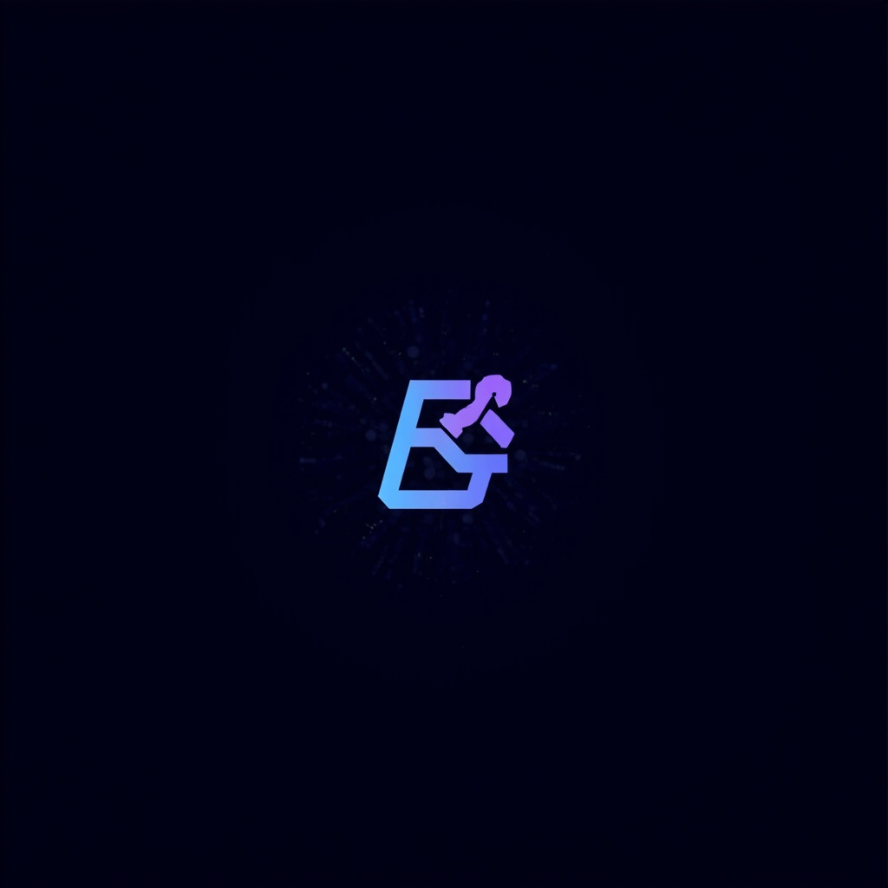

<p align="center">
  
</p>

<h1 align="center">AGI Super Team</h1>

<p align="center">
  <strong>2,600+ AI Skills · 14 C-Suite Agents · 31 Thinking Frameworks</strong><br/>
  Build your AI-native company in minutes.
</p>

<p align="center">
  <a href="https://github.com/openclaw/openclaw"></a>
  <a href="./LICENSE"></a>
  
  
  
</p>

<p align="center">
  <a href="./README_CN.md">中文</a> ·
  <a href="#quick-start">Quick Start</a> ·
  <a href="./skills/README.md">All Skills</a> ·
  <a href="./agents/README.md">Agents</a> ·
  <a href="./cookbook/">Cookbooks</a> ·
  <a href="./starter-kits/">Starter Kits</a> ·
  <a href="./setup.md">Agent Setup Guide</a>
</p>

---

## 🤖 For AI Agents

> **If you are Claude Code / OpenClaw / Codex / Cursor, read this file: [`setup.md`](./setup.md)**
>
> Or just tell your Agent:
> ```
> Install AGI Super Team for me: https://github.com/aAAaqwq/AGI-Super-Team
> I want the solo-founder kit
> ```

## 💡 What Is This?

A **plug-and-play AI team template** — deploy a complete virtual C-Suite using [OpenClaw](https://github.com/openclaw/openclaw). Each agent is shaped by a **spirit mentor** (Elon Musk, Jensen Huang, Warren Buffett, Richard Feynman...) that defines their personality, decision-making style, and cognitive framework.

**2,659 skills. 14 agents. 31 thinking frameworks. 30 workflows.** Zero boilerplate — copy, customize, ship.

## 🏛️ Architecture

```
You (Founder / Chairman)
  └── 👑 CEO — Strategy, coordination, quality gate
        ├── ⚡ CTO — Architecture, technology strategy, R&D direction
        ├── 🎨 CPO — Product design, UX, brand DNA
        ├── 📈 CQO — Quant trading, algorithmic strategies
        ├── 📣 CMO — Marketing, SEO, growth
        ├── 💰 CFO — Finance, P&L, capital allocation
        ├── 📊 CDO — Data pipelines, analytics, governance
        ├── ✍️ CCO — Content creation, viral growth
        ├── ⚖️ CLO — Legal, compliance, IP protection
        ├── 🔬 CRO — Deep research, frontier intelligence
        ├── 🤝 CSO — Sales, BD, revenue growth
        ├── ⚙️ COO — Ops, OKRs, cross-team coordination
        ├── 💻 PE  — Production engineering, DevOps, delivery
        └── ⚖️ Governor — Quality assurance, delivery audit, escalation
```

## 👥 Agents

| Agent | Role | Spirit Mentor | Thinking |
|-------|------|---------------|----------|
| [`ceo`](./agents/ceo/) | 👑 CEO | Elon Musk | First Principles, Cross-Domain Synthesis |
| [`cto`](./agents/cto/) | ⚡ CTO | Jensen Huang | Systems Thinking, Accelerated Computing |
| [`cpo`](./agents/cpo/) | 🎨 CPO | Steve Jobs | Design Thinking, Radical Simplicity |
| [`cqo`](./agents/cqo/) | 📈 CQO | Jim Simons | Mathematical Rigor, Probabilistic Thinking |
| [`cmo`](./agents/cmo/) | 📣 CMO | David Ogilvy | Data-Driven Storytelling, Audience Psychology |
| [`cfo`](./agents/cfo/) | 💰 CFO | Warren Buffett | Value Investing, Margin of Safety |
| [`cdo`](./agents/cdo/) | 📊 CDO | Nate Silver | Bayesian Reasoning, Predictive Analytics |
| [`cco`](./agents/cco/) | ✍️ CCO | MrBeast | Viral Mechanics, Platform Algorithms |
| [`clo`](./agents/clo/) | ⚖️ CLO | Alan Dershowitz | Legal Reasoning, Risk Assessment |
| [`cro`](./agents/cro/) | 🔬 CRO | Richard Feynman | Scientific Method, Feynman Technique |
| [`cso`](./agents/cso/) | 🤝 CSO | Michael Dell | Solution Selling, Relationship Building |
| [`coo`](./agents/coo/) | ⚙️ COO | Andy Grove | High Output Management, OKR Discipline |
| [`pe`](./agents/pe/) | 💻 PE | Linus Torvalds, antirez, DHH | Pragmatic Engineering, Ship Over Talk |
| [`governor`](./agents/governor/) | ⚖️ Governor | Zhuge Liang, Wang Yangming | Tri-Verification, Evidence-Based Audit |

> Each agent folder contains `SOUL.md` (personality), `AGENTS.md` (operations), `TOOLS.md` (skill links). Fully customizable.

## 🧠 Thinking Frameworks

31 distilled thinking skills based on real-world mentors — mental models, decision frameworks, and classic quotes with sources:

```bash
# Inject a mentor's thinking into any agent
cp -r skills/thinking-elon-musk/ ~/.openclaw/workspace-ceo/skills/

# Or inject all frameworks to all workspaces
for agent in ceo cto cpo cqo cmo cfo cdo cco clo cro cso coo pe; do
  mkdir -p ~/.openclaw/workspace-${agent}/skills/
  cp -r skills/thinking-* ~/.openclaw/workspace-${agent}/skills/
done
```

## 🛠️ Skill Categories

| Category | Highlights |
|----------|-----------|
| 🔌 SaaS Integrations | Notion, Airtable, HubSpot, Stripe, ActiveCampaign, 60+ more |
| 📝 Content & Writing | SEO, viral copy, anti-AI-slop, social media |
| 🔧 Development | Backend, frontend, Docker, Git, TDD, API design, code review |
| 💰 Trading & Finance | Crypto, Polymarket, DeFi, portfolio management, backtesting |
| ⚙️ OpenClaw Tools | Config, auth, cron, MCP, token guard, agent orchestration |
| 🤖 AI Agent Patterns | Multi-agent orchestration, parallel execution, sub-agents |
| 📊 Data & Analytics | Web scraping, DuckDB, CSV pipelines, arXiv |
| 📈 Marketing & SEO | SEO audits, GEO optimization, A/B testing, competitor analysis |
| 🎨 Design & Media | Image generation, UI/UX, brand identity |
| 🏢 Business & Strategy | SaaS launch, competitor teardown, financial modeling |
| 📋 Project Management | PRD, roadmaps, Scrum, team coordination |
| 💬 Communication | Email, Feishu, WeChat, Telegram, LinkedIn, cross-instance messaging |
| 📱 Chinese Platforms | Xiaohongshu, Douyin, WeChat MP, Juejin, Zhihu |
| ⚙️ DevOps & Infra | AWS, Docker, Linux, observability, deployment |
| 🧬 Bioinformatics | Genome analysis, metagenomics, pharmacogenomics |
| 🎬 Video & Digital Human | Video editing, digital human, storyboard, subtitle |
| 🤖 Web3 & Autonomys | Decentralized storage, auto-deploy, auto-memory |

👉 **[Full skill catalog →](./skills/README.md)**

## 🔄 Workflows

30 production-ready workflows across all C-Suite roles:

| Scope | Examples |
|-------|---------|
| **Shared** | Daily standup, weekly review, crisis escalation, cross-agent handoff |
| **Per-Agent** | Content pipeline (CCO), market morning brief (CQO), P&L tracking (CFO), code review (PE), incident response (COO) |

Each agent directory (e.g. `agents/cco/WORKFLOW.md`) contains role-specific and shared workflows.

## ⚡ Quick Start

### One-command deploy (recommended)

```bash
# Prerequisites: Node.js v20+ and OpenClaw
npm install -g openclaw

# Deploy a starter kit — pick your role:
curl -sSL https://raw.githubusercontent.com/aAAaqwq/AGI-Super-Team/main/install.sh | bash -s -- solo-founder    # 🚀 Solo founder
# curl ... | bash -s -- content-creator   # 🎨 Content creator
# curl ... | bash -s -- quant-trader      # 📈 Quant trader
# curl ... | bash -s -- full-team         # 🏛️ All 14 agents

# Configure API keys, then restart
openclaw config
openclaw gateway restart
```

### Starter Kits

| Kit | Agents | Best for |
|-----|--------|----------|
| 🚀 [**Solo Founder**](./starter-kits/solo-founder/) | CEO + PE + CCO | Indie hackers, solo founders |
| 🎨 [**Content Creator**](./starter-kits/content-creator/) | CCO + CDO + CMO | Content teams, self-media |
| 📈 [**Quant Trader**](./starter-kits/quant-trader/) | CQO + CDO + CFO | Quant trading, investment |
| 🏛️ **Full Team** | All 14 agents | Complete AI-native company |

### Manual deploy

```bash
git clone https://github.com/aAAaqwq/AGI-Super-Team.git
cd AGI-Super-Team
./install.sh solo-founder    # or any kit / agent name
```

## 📚 Cookbooks

In-depth learning guides in [`cookbook/`](./cookbook/):

| Book | Description |
|------|-------------|
| [Self-Media Operations](./cookbook/self-media-operations-handbook/) | Complete handbook: XHS, Douyin, WeChat, content strategy |
| [Quantitative Trading](./cookbook/quant-learning/) | Crypto trading, algorithmic strategies, risk management |
| [Prompt Engineering](./cookbook/prompt-engineering-learning/) | Advanced prompt techniques and patterns |
| [Knowledge Base](./cookbook/knowledge-book/) | Cross-domain knowledge distillation |
| [Crypto Deep Dive](./cookbook/crypto-learning/) | Blockchain fundamentals and DeFi |

## 📁 Repository Structure

```
AGI-Super-Team/
├── agents/           # 14 C-Suite agent personas
│   ├── ceo/          # SOUL.md · AGENTS.md · TOOLS.md · WORKFLOW.md
│   ├── cto/          # ...
│   ├── governor/     # Quality assurance & delivery audit
│   └── README.md     # Architecture diagram & skill matrix
├── skills/           # 2,659 skills (flat structure, each with SKILL.md)
│   └── README.md     # Full catalog
├── starter-kits/     # One-click deployment bundles
│   ├── solo-founder/ # CEO + PE + CCO
│   ├── content-creator/ # CCO + CDO + CMO
│   └── quant-trader/ # CQO + CDO + CFO
├── cookbook/         # 5 in-depth learning guides
├── install.sh        # One-click deployer
├── CHARTER.md        # Team constitution (12 principles)
├── STARTUP.md        # Quick-start guide
├── COLLABORATION.md  # Inter-agent collaboration network
```

## 🤝 Contributing

Contributions welcome! See [CONTRIBUTING.md](./CONTRIBUTING.md) for guidelines.

1. Fork the repo
2. Create your skill: `skills/your-skill/SKILL.md`
3. Submit a PR

## 📄 License

[MIT](./LICENSE) — use freely, attribution appreciated.

---

## ⭐ Star History

<a href="https://star-history.com/#aAAaqwq/AGI-Super-Team&Date">
 <picture>
   <source media="(prefers-color-scheme: dark)" srcset="https://api.star-history.com/svg?repos=aAAaqwq/AGI-Super-Team&type=Date&theme=dark" />
   <source media="(prefers-color-scheme: light)" srcset="https://api.star-history.com/svg?repos=aAAaqwq/AGI-Super-Team&type=Date" />
   
 </picture>
</a>

---

<p align="center">
  Built with ❤️ using <a href="https://github.com/openclaw/openclaw">OpenClaw</a>
</p>
