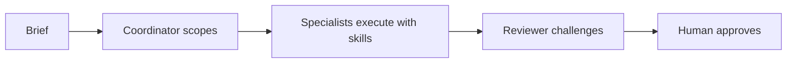
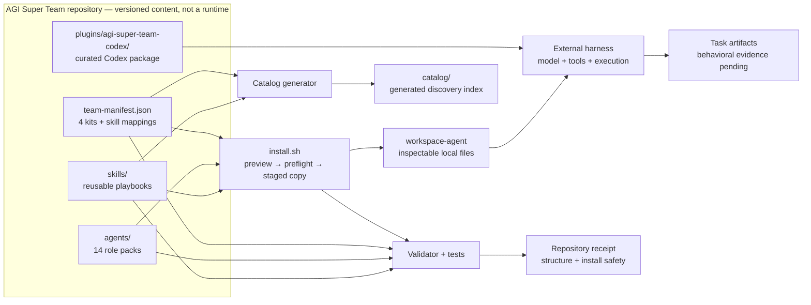
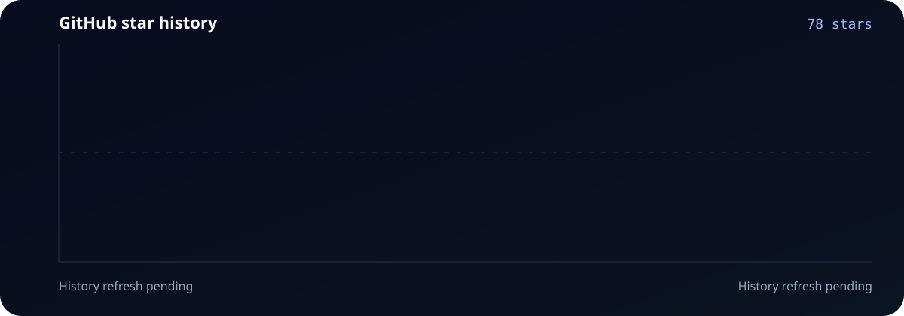

<p align="center">
  
</p>

<h1 align="center">AGI Super Team</h1>

<p align="center"><strong>Composable skills. Specialist agents. Reviewable team workflows.</strong></p>

<p align="center">
  Use one brief to structure scoped work, specialist tasks, independent review, and an explicit human approval gate.
</p>

<p align="center">
  <a href="./README_CN.md">中文</a> ·
  <a href="#the-system-in-one-minute">How it works</a> ·
  <a href="#start-with-an-outcome">Starter kits</a> ·
  <a href="#try-it-safely">Quick start</a> ·
  <a href="#browse-skills-by-outcome">Skills</a> ·
  <a href="#repository-architecture">Architecture</a>
</p>

<p align="center">
  <a href="https://github.com/aAAaqwq/AGI-Super-Team/actions/workflows/validate-repository.yml"></a>
  <a href="./LICENSE"></a>
  
</p>

AGI Super Team is a versioned library of **AI agent skills, specialist role packs, and human-in-the-loop team workflows** for Codex and local coding-agent workspaces.

<p align="center">
  <a href="#try-it-safely"><strong>Preview Solo Founder</strong></a> ·
  <a href="./.codex/INDEX.md">Inspect the Codex package</a> ·
  <a href="#browse-skills-by-outcome">Browse skills</a><br>
  <sub>Generic preview requires Bash + Node.js</sub>
</p>

## 🧠 The system in one minute

| Layer | What you get | Why it matters |
|---|---|---|
| **🧩 Skills** | 793 canonical physical `SKILL.md` files grouped into 14 outcome categories | Reuse focused playbooks instead of rebuilding instructions for every task |
| **🤖 Agents** | 14 inspectable role packs with persona, workflow, and tool guidance | Give planning, engineering, content, research, and review clear ownership |
| **🔁 Team packs** | 4 manifest-driven combinations, including 3 focused starter kits | Start with a small team for one outcome instead of loading everything |

The packs are designed for this review loop:



AGI Super Team owns the versioned content, selection rules, safe copying, and repository checks. Your configured coding-agent harness owns the model, credentials, tools, execution, and final task output.

## 🎯 Start with an outcome

| Starter kit | Give it | Intended evaluation outputs | Team |
|---|---|---|---|
| [🚀 Solo Founder](./starter-kits/solo-founder/) | A product or launch brief | Decision memo, test-first implementation plan, launch drafts | CEO · PE · CCO |
| [✍️ Content Creator](./starter-kits/content-creator/) | Source material and an audience | Research notes, content drafts, measurement plan | CCO · CDO · CMO |
| [📊 Quant Research](./starter-kits/quant-trader/) | A research question and historical data | Research memo, backtest plan, risk review—never a live trade | CQO · CDO · CFO |

Need wider coverage? `full-team` selects all 14 manifest Agents. Start with a focused kit unless your evaluation genuinely needs every role.

## ⚡ Try it safely

Using Codex? Inspect the [separately packaged Codex distribution](./.codex/INDEX.md). Its repository structure is tested; installation and loading in a current Codex client remain **Validation pending**.

To evaluate the generic workspace path, clone `main` and preview Solo Founder. Preview is the default and writes nothing:

```bash
git clone --depth 1 --branch main https://github.com/aAAaqwq/AGI-Super-Team.git
cd AGI-Super-Team
git rev-parse HEAD
./install.sh --source "$PWD" --destination /path/to/review-workspace solo-founder
```

Inspect the selected Agents and destinations. Apply only when they match your intent:

```bash
./install.sh --source "$PWD" --destination /path/to/review-workspace --apply solo-founder
```

The generic installer validates every required file before publishing staged workspaces. It preserves existing persona and skill files and rejects dangerous source or destination symlinks. See [setup.md](./setup.md) for prerequisites, updates, and recovery.

**Success:** the preview writes nothing; apply creates three inspectable role workspaces without overwriting existing files.

## 🧭 Browse skills by outcome

The root README stays curated. Use the generated catalog when you need the complete, searchable inventory.

| Build and operate | Reach and create | Decide and automate |
|---|---|---|
| [🤖 AI Agents & Orchestration](./catalog/#ai-agents-orchestration) | [📈 Marketing, SEO & Growth](./catalog/#marketing-seo-growth) | [📊 Data, Analytics & Research](./catalog/#data-analytics-research) |
| [💻 Software Engineering](./catalog/#software-engineering) | [✍️ Content, Media & Publishing](./catalog/#content-media-publishing) | [🧭 Business Operations & Strategy](./catalog/#business-operations-strategy) |
| [☁️ Cloud, DevOps & Reliability](./catalog/#cloud-devops-reliability) | [🤝 Sales, CRM & Customer Success](./catalog/#sales-crm-customer-success) | [⚙️ Apps & Workflow Automation](./catalog/#apps-workflow-automation) |
| [🛡️ Security, Privacy & Legal](./catalog/#security-privacy-legal) | [🎨 Product, Design & UX](./catalog/#product-design-ux) | [💹 Finance, Trading & Markets](./catalog/#finance-trading-markets) |
| [🧰 Specialized Domains & Utilities](./catalog/#general-utilities) | [🇨🇳 Chinese Platform Workflows](./catalog/#chinese-platform-workflows) | |

Explore the repository by depth:

| Path | Best for |
|---|---|
| [Skills overview](./skills/) | Support levels, bounded starting points, and discovery guidance |
| [Generated skill catalog](./catalog/) | Every canonical physical skill grouped by task outcome |
| [Agents](./agents/) | Persona, identity, workflow, and tool guidance |
| [Practical guides](./docs/guides/) | Codex, Claude Code, compatibility, team choice, and workflow boundaries |
| [Cookbooks](./cookbook/) | Longer material for content, prompts, research, and quantitative workflows |

## ✅ What is useful today

You can already browse a deterministic skill catalog, inspect every Agent instruction, preview a manifest-selected team, and assemble local role workspaces without overwriting existing files.

| Claim | Evidence | Status |
|---|---|---|
| Repository inventory, counts, and references | `npm run validate -- --warnings-as-errors` | **Verified in this checkout** |
| Generic installer preview, preflight, no-clobber, and staging | `npm test` | **Verified in this checkout** |
| Generated catalog covers the canonical inventory | `npm run check:skills` | **Verified in this checkout** |
| Current-client harness installation and loading | Revision-matched harness receipt | **Validation pending** |
| Task quality or business outcome | Public fixture, baseline, rubric, and artifacts | **Validation pending** |

## 🧾 Reproducible installation receipt

Create a disposable destination, prove preview wrote nothing, apply, and verify the three expected Solo Founder workspaces:

```bash
AGI_SOLO_DEST="$(mktemp -d "${TMPDIR:-/tmp}/agi-solo-founder.XXXXXX")"

./install.sh --source "$PWD" --destination "$AGI_SOLO_DEST" solo-founder
test -z "$(find "$AGI_SOLO_DEST" -mindepth 1 -print -quit)"

./install.sh --source "$PWD" --destination "$AGI_SOLO_DEST" --apply solo-founder
test -f "$AGI_SOLO_DEST/workspace-ceo/SOUL.md"
test -f "$AGI_SOLO_DEST/workspace-pe/SOUL.md"
test -f "$AGI_SOLO_DEST/workspace-cco/SOUL.md"

npm test
npm run validate -- --warnings-as-errors
npm run check:skills
```

This receipt proves manifest-driven selection, preview safety, staged copying, and repository integrity for the inspected checkout and destination state. It does not prove harness loading, task quality, or business outcomes.

<details>
<summary><strong>👀 See the preview → apply → verify storyboard</strong></summary>

<p align="center">
  
</p>

The animation uses sanitized paths and is illustrative—not runtime evidence. Read the [storyboard transcript](./assets/demo-install.txt).

</details>

Did the preview-first workflow help? [Star the repository](https://github.com/aAAaqwq/AGI-Super-Team) so you can find the verified path again.

## 🔌 Choose a distribution

| Surface | Repository support | Start here | Evidence boundary |
|---|---|---|---|
| Generic/local workspace | Preview-first `install.sh` | Use the quick start above | Installer behavior is integration-tested |
| Codex | Separate curated package | [`.codex/INDEX.md`](./.codex/INDEX.md) | Package structure is tested; current-client load receipt pending |
| Claude Code | Plugin manifest present | [`.claude-plugin/`](./.claude-plugin/) | Confirm support in the installed client version |
| Cursor, Gemini, Kimi | Metadata or manifests present | Review the corresponding package files | Presence does not establish feature parity |

The generic path requires Bash and Node.js; repository verification also requires npm and Python 3. Exact operating-system and client-version support remains bounded by CI and published receipts.

## 🗂️ Repository architecture



| File or directory | Responsibility |
|---|---|
| [`config/team-manifest.json`](./config/team-manifest.json) | Source of truth for Agents, kits, and required or external skills |
| [`agents/`](./agents/) and [`skills/`](./skills/) | Authored, versioned inputs installed into generic workspaces |
| [`.codex/INDEX.md`](./.codex/INDEX.md) | Installation guide and Codex package index |
| [`plugins/agi-super-team-codex/`](./plugins/agi-super-team-codex/) | Actual curated Codex plugin, skills, and bundled agent roles |
| [`install.sh`](./install.sh) | Preview-first selection, preflight, staging, and no-clobber publishing |
| [`scripts/repository_model.py`](./scripts/repository_model.py) | Shared inventory and manifest model used by validation and generation |
| [`catalog/`](./catalog/) | Generated discovery output; never an inventory source |
| [`tests/`](./tests/) | Repository, installer, site-data, and SEO contracts |
| [`docs/`](./docs/) | Project site, verification data, and editorial guides |

[`config/external-skill-sources.json`](./config/external-skill-sources.json) records portable provenance for removed machine-local links. README text and generated catalog files are not inventory sources.

## 🧠 Team topology

```text
Founder / operator
└── CEO — coordination and quality gates
    ├── CTO / PE — architecture and implementation
    ├── CPO / CCO / CMO — product, content, and growth
    ├── CQO / CFO / CDO — quantitative research, finance, and data
    ├── CLO / CRO / CSO / COO — legal, research, sales, and operations
    └── Governor — independent review and escalation
```

Mentor names are creative framing. They do not imply affiliation, endorsement, or guaranteed imitation.

## 🛡️ Boundaries and human approval

AGI Super Team is not a model, autonomous orchestrator, or agent runtime. Installing files does not make a harness load or execute them automatically.

- Inspect third-party commands and dependencies before execution.
- Never place credentials, private data, browser sessions, or production configuration in a skill or issue.
- Keep financial workflows in research or paper-trading environments until independently validated.
- Require explicit human approval for posts, messages, transactions, deployments, and destructive operations.
- Report vulnerabilities privately through [GitHub Security Advisories](https://github.com/aAAaqwq/AGI-Super-Team/security/advisories/new).

## 🤝 Contribute and get help

- [Report a reproducible issue](https://github.com/aAAaqwq/AGI-Super-Team/issues/new/choose)
- [Contributing and provenance](./CONTRIBUTING.md)
- [Setup and recovery](./setup.md)
- [Security policy](./SECURITY.md)
- [Growth playbooks](./growth/README.md)
- [MIT License](./LICENSE)

## ⭐ Star History



The chart is repository-owned, so README rendering does not depend on GitHub Pages. Historical refresh may show a cached or pending state when GitHub's stargazer API is unavailable.
