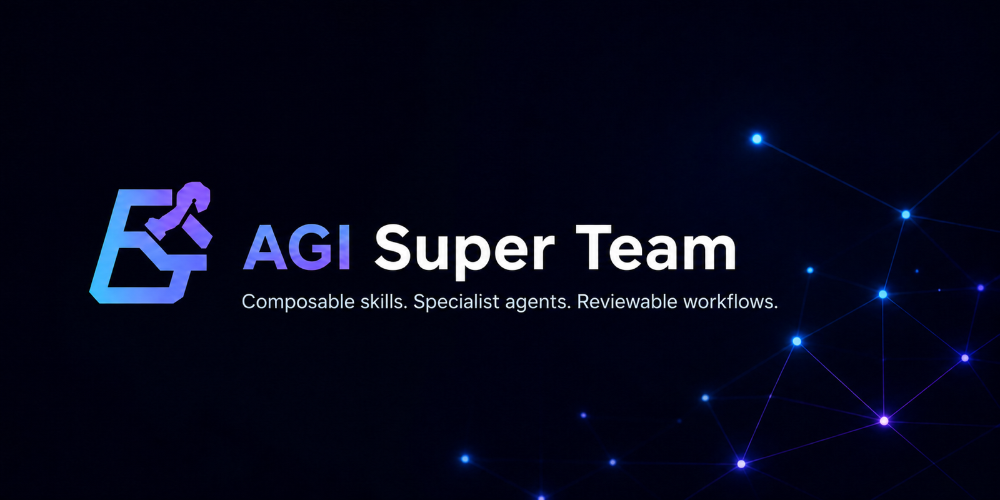
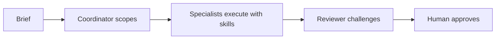
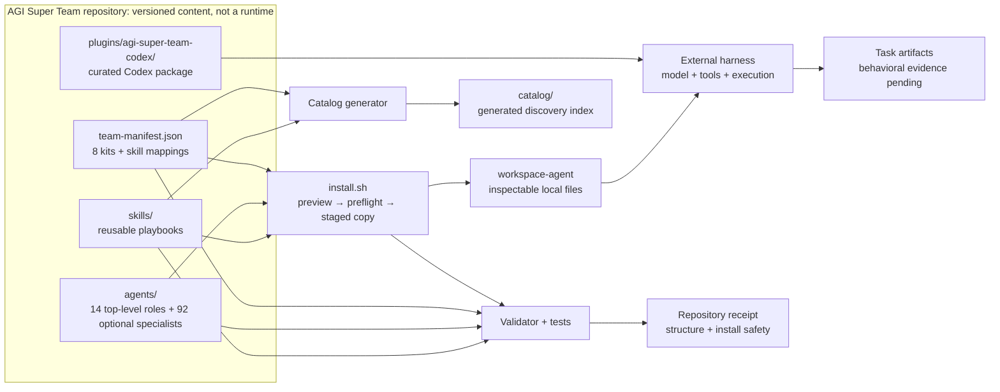

<p align="right"><a href="./README_CN.md">中文</a></p>

<p align="center">
  
</p>

<h1 align="center">AGI Super Team</h1>

<p align="center"><strong>An organized, installable team of Agents + Skills for local AI agent frameworks.</strong></p>

<p align="center">
  Start with an outcome. Let the CEO route executives, executives dispatch specialists, Skills supply methods, and the Governor verify the result.
</p>

AGI Super Team is not a Codex-only plugin. It is a versioned, organized **Agents + Skills team system** for Claude Code, Codex, OpenClaw, Hermes, and other mainstream local AI agent frameworks through 18 explicit adapters.

The same organizational contract travels across frameworks: 14 top-level roles, 92 opt-in specialists, reusable Skills, eight outcome Teams, independent review, and explicit human approval.

Each adapter maps that contract to the capabilities its target actually supports.

## Install into your agent framework

List all 18 adapter targets, preview one target, then apply the same selection:

```bash
npx -y github:aAAaqwq/AGI-Super-Team --list-tools
npx -y github:aAAaqwq/AGI-Super-Team --tool claude-code
npx -y github:aAAaqwq/AGI-Super-Team --tool claude-code --install
npx -y github:aAAaqwq/AGI-Super-Team --tool claude-code --doctor
```

Replace `claude-code` with an ID from `--list-tools`. Use `--all-tools` only when you intentionally want every global and project adapter. A no-argument run remains the legacy Codex preview; new automation should always name `--tool` or `--all-tools`.

### Four primary frameworks

| Platform | Preview command | Installed capability |
|---|---|---|
| **Claude Code** | `npx -y github:aAAaqwq/AGI-Super-Team --tool claude-code` | Native Markdown Agents + native Skills |
| **Codex** | `npx -y github:aAAaqwq/AGI-Super-Team --tool codex` | Native TOML Agents + Codex plugin Skills; the currently runtime-verified adapter |
| **OpenClaw** | `npx -y github:aAAaqwq/AGI-Super-Team --tool openclaw` | Native Agent workspaces + native Skills |
| **Hermes Agent** | `npx -y github:aAAaqwq/AGI-Super-Team --tool hermes` | Native Skills; role packs are exposed as Skills rather than native Agents |

For OpenClaw, the installer materializes Agent workspaces but does not register them; review and register the desired workspaces explicitly after installation.

Claude Code, Codex, OpenClaw, and Hermes are first-class entry points to the same team system, not separate editions with different organizations.

Delivery format varies because each framework exposes different native Agent and Skill primitives.

### Install executive subagent groups

The default remains the 14 top-level roles. Add one executive pyramid, or all 92 optional specialists:

```bash
npx -y github:aAAaqwq/AGI-Super-Team --tool codex --with-subagents cto
npx -y github:aAAaqwq/AGI-Super-Team --tool codex --with-subagents cfo --with-subagents clo
npx -y github:aAAaqwq/AGI-Super-Team --tool codex --all-subagents --install
```

The hierarchy is CEO → eleven manager executives → leaf specialists. CTO also references the existing canonical PE as delivery lead; it does not create a second PE identity. All 92 source files under `agents/*/subagents/*/AGENTS.md` are byte-for-byte copies from pinned `jnMetaCode/agency-agents-zh`; local routing and safety envelopes remain separate. CEO retains coordination authority, Governor remains an independent reviewer, and PE remains CTO's canonical delivery leaf rather than another manager. See [`config/agent-sources.lock.json`](./config/agent-sources.lock.json) for source URLs and SHA-256 digests. Nested Codex routing requires `max_depth = 2`; with four threads, run one manager plus at most two children per wave.

These are **18 AI client/runtime adapter targets**, not 18 interchangeable CLIs. An adapter can install native Agents, native Skills, project rules/context, or role packs degraded to Agent-as-Skill. File placement does not by itself prove that a current client loaded or executed the content.

### All 18 adapter targets

Paths for global adapters are relative to the selected home; project adapters are relative to the selected project directory.

| ID | Client/runtime | Scope | Agent delivery | Skill delivery | Status |
|---|---|---|---|---|---|
| `claude-code` | Claude Code | Global | Native Markdown Agent: `.claude/agents` | Native: `.claude/skills` | Native adapter |
| `codex` | Codex | Global | Native TOML Agent: `.codex/agents` | Native plugin: `.codex/skills` | Runtime-verified adapter |
| `openclaw` | OpenClaw | Global | Native workspace: `.openclaw/agency-agents` | Native: `.openclaw/skills/agi-super-team` | Native adapter |
| `hermes` | Hermes Agent | Global | Agent-as-Skill: `.hermes/skills/agi-super-team-agents` | Native: `.hermes/skills/agi-super-team` | Native Skills |
| `copilot` | GitHub Copilot | Global | Markdown Agent: `.github/agents`, `.copilot/agents` | Native: `.copilot/skills` | Adapter |
| `antigravity` | Antigravity | Global | Agent: `.gemini/config/agents` | Native: `.gemini/config/skills` | **Experimental** |
| `gemini-cli` | Gemini CLI | Global | Markdown Agent: `.gemini/agents` | Native: `.gemini/skills` | Adapter |
| `opencode` | OpenCode | Global | Markdown Agent: `.config/opencode/agents` | Native: `.config/opencode/skills` | Adapter |
| `cursor` | Cursor | Global | Markdown Agent: `.cursor/agents` | Native: `.cursor/skills` | **Experimental** |
| `trae` | Trae | Project | Project rule: `.trae/rules` | Native: `.trae/skills` | Project adapter |
| `aider` | Aider | Project | Combined project rules: `CONVENTIONS.md` | Combined into the same project context | Project adapter |
| `windsurf` | Windsurf | Project | Combined project rules: `.windsurfrules` | Combined into the same project context | Project adapter |
| `qwen` | Qwen Code | Global | Markdown Agent: `.qwen/agents` | Native: `.qwen/skills` | Adapter |
| `deerflow` | DeerFlow | Project | Agent-as-Skill: `skills/custom/agi-super-team-agents` | Native: `skills/custom/agi-super-team` | Project adapter |
| `workbuddy` | WorkBuddy | Global | Agent-as-Skill: `.workbuddy/skills/agi-super-team-agents` | Native: `.workbuddy/skills/agi-super-team` | Adapter |
| `codewhale` | CodeWhale | Global | Agent-as-Skill: `.codewhale/skills/agi-super-team-agents` | Native: `.codewhale/skills/agi-super-team` | Adapter |
| `kiro` | Kiro | Global | Markdown Agent: `.kiro/agents` | Native: `.kiro/skills` | Adapter |
| `qoder` | Qoder | Global | Markdown Agent: `.qoder/agents` | Native: `.qoder/skills` | Adapter |

The matrix describes the adapter contract in [`config/cli-adapters.json`](./config/cli-adapters.json), not a claim that all 18 clients have been runtime-verified. Cursor and Antigravity are explicitly experimental.

### Select destinations, refresh, and verify

Use `--home` to redirect global targets and `--project-dir` for project-scoped targets (the project directory defaults to the current directory). This makes a disposable audit easy:

```bash
AGI_AUDIT_HOME="$(mktemp -d "${TMPDIR:-/tmp}/agi-super-team-home.XXXXXX")"
AGI_AUDIT_PROJECT="$(mktemp -d "${TMPDIR:-/tmp}/agi-super-team-project.XXXXXX")"

npx -y github:aAAaqwq/AGI-Super-Team --tool openclaw \
  --home "$AGI_AUDIT_HOME" --project-dir "$AGI_AUDIT_PROJECT"
npx -y github:aAAaqwq/AGI-Super-Team --tool openclaw \
  --home "$AGI_AUDIT_HOME" --project-dir "$AGI_AUDIT_PROJECT" --install
npx -y github:aAAaqwq/AGI-Super-Team --tool openclaw \
  --home "$AGI_AUDIT_HOME" --project-dir "$AGI_AUDIT_PROJECT" --doctor
```

Run the same `--install` command again to refresh managed content; repeat `--doctor` afterward. Restart or open a new task in the target client, then verify that it discovers the expected Agent/Skill surface. `--doctor` verifies installed adapter artifacts, not model behavior or task quality.

### Safety and update limits

- Preview is the default and performs no writes; `--install` is the explicit write boundary.
- Reapplying the same selection is designed to be idempotent. Differing managed destinations are backed up before replacement; unrelated client files are outside the managed selection.
- Backups are local recovery aids, not a complete snapshot or uninstall system. Review the preview and keep your own version-control or filesystem backup for important configuration.
- Symlinked or unsafe destinations are refused. `--no-agents` and `--no-skills` can narrow the payload when needed.
- This project does not use a remote-script pipe installer; the commands above use npm's package runner and still deserve normal dependency review.
- Installation proves file materialization only. Except for the adapter explicitly marked runtime-verified, current-client loading and execution remain unverified until supported by a commit-matched receipt.

The adapter design was inspired in part by [`jnMetaCode/agency-agents-zh`](https://github.com/jnMetaCode/agency-agents-zh) at fixed commit [`2ecfabf8`](https://github.com/jnMetaCode/agency-agents-zh/commit/2ecfabf8e944ccdfed63ad8c44d5241290af6977). AGI Super Team's manifest, payload mapping, safety behavior, and evidence boundaries are maintained here.

<p align="center">
  <a href="#install-into-your-agent-framework"><strong>Install the team</strong></a>&nbsp;&nbsp;|&nbsp;&nbsp;
  <a href="./.codex/INDEX.md">Inspect the Codex package</a>
</p>

## 🧠 The system in one minute

| Layer | What you get | Why it matters |
|---|---|---|
| **🧩 Skills** | Canonical physical `SKILL.md` files grouped into 14 outcome categories | Reuse focused playbooks instead of rebuilding instructions for every task |
| **🤖 Agents** | 14 top-level role packs plus 92 optional direct specialists with exact routing and source locks | Give planning, engineering, product, content, research, and review clear ownership |
| **🔁 Team packs** | 8 manifest-driven outcome Teams, from Solo Founder to Full Team | Start with the smallest team that can own the outcome instead of loading everything |

<p>
  <a href="https://github.com/aAAaqwq/AGI-Super-Team/actions/workflows/validate-repository.yml"></a>
  <a href="./LICENSE"></a>
  
</p>

The packs are designed for this review loop:



AGI Super Team owns the versioned content, selection rules, safe copying, and repository checks. Your configured coding-agent harness owns the model, credentials, tools, execution, and final task output.

## 🎯 Start with an outcome

Choose the army that matches the outcome. Each Team has a CEO coordinator, a bounded executive core, an independent Governor gate, and access to additional executives or specialists when a named evidence gap requires them.

| Team army | Give it | Intended evaluation outputs | Core team |
|---|---|---|---|
| [🚀 Solo Founder](./starter-kits/solo-founder/) | A bounded product idea or launch brief | Product decision, test-first plan, launch evidence, Governor decision | CEO, CPO, PE, Governor |
| [✍️ Content Creator](./starter-kits/content-creator/) | Approved sources, audience, and channel | Evidence brief, channel-ready drafts, measurement plan, claims review | CEO, CRO, CCO, CMO, Governor |
| [📊 Quant Research](./starter-kits/quant-trader/) | A hypothesis and historical data | Reproducible backtest specification, risk memo, independent gate | CEO, CQO, CDO, CFO, Governor |
| [🧱 Product Delivery](./starter-kits/product-delivery/) | A validated user problem and delivery constraints | Product brief, architecture decision, tested change, release handoff | CEO, CPO, CTO, PE, Governor |
| [🔬 Research Decision](./starter-kits/research-decision/) | A consequential question and decision criteria | Research plan, evidence map, cited synthesis, decision memo | CEO, CRO, CDO, Governor |
| [📣 Go To Market](./starter-kits/go-to-market/) | Validated positioning and a launch/revenue objective | Positioning brief, launch assets, revenue experiment, risk gate | CEO, CPO, CMO, CCO, CSO, Governor |
| [🚨 Operations Response](./starter-kits/operations-response/) | A bounded incident or delivery failure | Incident scope, containment, verified recovery, post-incident review | CEO, COO, CTO, PE, Governor |
| [🏛️ Executive Team](./starter-kits/full-team/) | A cross-functional company brief | Executive routing plan, specialist artifacts, independent review, verified handoff | All 14 top-level roles available; CEO coordinates, Governor reviews |

Start with the smallest complete army that can own the outcome. `full-team` makes all 14 top-level roles eligible, but the CEO still dispatches only the roles and specialists justified by the brief.

## ⚡ Legacy generic workspace materializer

The multi-client npm installer above is the primary entry point. The older `install.sh` path remains useful when you want harness-neutral, inspectable role workspaces instead of a client adapter. Clone `main` and preview Solo Founder; preview is the default and writes nothing:

```bash
git clone --depth 1 --branch main https://github.com/aAAaqwq/AGI-Super-Team.git
cd AGI-Super-Team
git rev-parse HEAD
./install.sh --source "$PWD" --destination /path/to/review-workspace solo-founder
```

Inspect the selected Agents and destinations. Apply only when they match your intent:

```bash
./install.sh --source "$PWD" --destination /path/to/review-workspace --apply solo-founder
```

The generic installer validates every required file before publishing staged workspaces. It preserves existing persona and skill files and rejects dangerous source or destination symlinks. See [setup.md](./setup.md) for prerequisites, updates, and recovery.

The manifest separates portable `required`/`optional` Skills from `harnessSpecific` catalog entries and unbundled external recommendations. Generic installs copy only classes that pass the current portability contract; the complete copied payload is scanned for known host paths and runtime-only commands.

**Success:** the preview writes nothing; apply creates three inspectable role workspaces without overwriting existing files.

## 🧭 Browse skills by outcome

The root README stays curated. Use the generated catalog when you need the complete, searchable inventory.

| Build and operate | Reach and create | Decide and automate |
|---|---|---|
| [🤖 AI Agents & Orchestration](./catalog/#ai-agents-orchestration) | [📈 Marketing, SEO & Growth](./catalog/#marketing-seo-growth) | [📊 Data, Analytics & Research](./catalog/#data-analytics-research) |
| [💻 Software Engineering](./catalog/#software-engineering) | [✍️ Content, Media & Publishing](./catalog/#content-media-publishing) | [🧭 Business Operations & Strategy](./catalog/#business-operations-strategy) |
| [☁️ Cloud, DevOps & Reliability](./catalog/#cloud-devops-reliability) | [🤝 Sales, CRM & Customer Success](./catalog/#sales-crm-customer-success) | [⚙️ Apps & Workflow Automation](./catalog/#apps-workflow-automation) |
| [🛡️ Security, Privacy & Legal](./catalog/#security-privacy-legal) | [🎨 Product, Design & UX](./catalog/#product-design-ux) | [💹 Finance, Trading & Markets](./catalog/#finance-trading-markets) |
| [🧰 Specialized Domains & Utilities](./catalog/#general-utilities) | [🇨🇳 Chinese Platform Workflows](./catalog/#chinese-platform-workflows) | |

Explore the repository by depth:

| Path | Best for |
|---|---|
| [Skills overview](./skills/) | Support levels, bounded starting points, and discovery guidance |
| [Generated skill catalog](./catalog/) | Every canonical physical skill grouped by task outcome |
| [Agents](./agents/) | Persona, identity, workflow, and tool guidance |
| [Practical guides](./docs/guides/) | Codex, Claude Code, compatibility, team choice, and workflow boundaries |
| [Cookbooks](./cookbook/) | Longer material for content, prompts, research, and quantitative workflows |
| [Architecture map](./ARCHITECTURE.md) | Sources of truth, generated outputs, public entry points, and change ownership |
| [Shared language](./CONTEXT.md) | Module, Interface, Adapter, evidence, and product terminology |

### 🔎 Find high-quality skill sources

[`agent-skill-repository-index`](./skills/agent-skill-repository-index/) turns Daniel's reviewed source list into a safe selection workflow. Compare one candidate, inspect its permissions and provenance, then install or remove it without globally activating entire repositories.

| Need | Maintained reference |
|---|---|
| Compare reviewed sources | [Source matrix](./skills/agent-skill-repository-index/references/repositories.md) |
| Inspect the dated popularity signal | [Star snapshot](./skills/agent-skill-repository-index/references/star-snapshot.md) |
| Install one candidate safely | [Installation workflow](./skills/agent-skill-repository-index/references/installing.md) |

Stars help with discovery, not trust. The matrix records `DAILY`, `LIBRARY`, and `QUARANTINE` boundaries; catalogs and runtimes are never bulk-installed.

## ✅ What is useful today

You can already browse a deterministic skill catalog, inspect every Agent instruction, preview a manifest-selected team, and assemble local role workspaces without overwriting existing files.

| Claim | Evidence | Status |
|---|---|---|
| Repository inventory, counts, and references | `npm run validate -- --warnings-as-errors` | **Verified in this checkout** |
| Generic installer preview, preflight, no-clobber, and staging | `npm test` | **Verified in this checkout** |
| Generated catalog covers the canonical inventory | `npm run check:skills` | **Verified in this checkout** |
| Primary-outcome classification agrees with the fixed reviewed set | [Gold Set method](./docs/skill-taxonomy-gold-set.md) + [generated report](./catalog/skill-taxonomy-evaluation.json) | **Reviewed-set gate passed in this checkout** |
| Client loading for an adapter without a matching receipt | Revision-matched harness receipt | **Validation pending** |
| Task quality or business outcome | Public fixture, baseline, rubric, and artifacts | **Validation pending** |

## 🧾 Reproducible installation receipt

Create a disposable destination, prove preview wrote nothing, apply, and verify the three expected Solo Founder workspaces:

```bash
AGI_SOLO_DEST="$(mktemp -d "${TMPDIR:-/tmp}/agi-solo-founder.XXXXXX")"

./install.sh --source "$PWD" --destination "$AGI_SOLO_DEST" solo-founder
test -z "$(find "$AGI_SOLO_DEST" -mindepth 1 -print -quit)"

./install.sh --source "$PWD" --destination "$AGI_SOLO_DEST" --apply solo-founder
test -f "$AGI_SOLO_DEST/workspace-ceo/SOUL.md"
test -f "$AGI_SOLO_DEST/workspace-pe/SOUL.md"
test -f "$AGI_SOLO_DEST/workspace-cco/SOUL.md"

python3 -m venv .venv
. .venv/bin/activate
python -m pip install --requirement requirements-dev.txt
npm test
npm run validate -- --warnings-as-errors
npm run check:skills
npm run check:taxonomy-evaluation
npm run check:architecture
```

This receipt proves manifest-driven selection, preview safety, staged copying, and repository integrity for the inspected checkout and destination state. It does not prove harness loading, task quality, or business outcomes.

<details>
<summary><strong>👀 See the preview → apply → verify storyboard</strong></summary>

<p align="center">
  
</p>

The animation uses sanitized paths and is illustrative, not runtime evidence. Read the [storyboard transcript](./assets/demo-install.txt).

</details>

Did the preview-first workflow help? [Star the repository](https://github.com/aAAaqwq/AGI-Super-Team) so you can find the verified path again.

## 🔌 Choose a distribution

Use the [18-target npm installer](#install-into-your-agent-framework) for a named Agent framework, the [curated Codex package](./.codex/INDEX.md) for Codex-specific details, or the legacy generic workspace materializer above for harness-neutral files. The [Claude Code guide](./docs/guides/claude-code-install.html) and [Harness compatibility guide](./docs/guides/harness-compatibility.html) provide additional background, but the current adapter manifest and commit-matched receipts govern support claims.

The generic path requires Bash and Node.js; repository verification also requires npm and Python 3. Exact operating-system and client-version support remains bounded by CI and published receipts. Adapter presence never establishes feature parity.

## 🗂️ Repository architecture



| File or directory | Responsibility |
|---|---|
| [`config/team-manifest.json`](./config/team-manifest.json) | Source of truth for Agents, kits, and portable, harness-specific, or external Skill assignments |
| [`config/repository-architecture.json`](./config/repository-architecture.json) | Machine-readable Modules, path owners, generated lineage, and Adapter status |
| [`agents/`](./agents/) and [`skills/`](./skills/) | Authored, versioned inputs; only manifest-classified portable payloads enter generic workspaces |
| [`.codex/INDEX.md`](./.codex/INDEX.md) | Installation guide and Codex package index |
| [`plugins/agi-super-team-codex/`](./plugins/agi-super-team-codex/) | Actual curated Codex plugin, skills, and bundled agent roles |
| [`install.sh`](./install.sh) | Preview-first selection, preflight, staging, and no-clobber publishing |
| [`scripts/repository_model.py`](./scripts/repository_model.py) | Shared inventory and manifest model used by validation and generation |
| [`catalog/`](./catalog/) | Generated discovery output; never an inventory source |
| [`tests/`](./tests/) | Repository, installer, site-data, and SEO contracts |
| [`docs/`](./docs/) | Project site, verification data, and editorial guides |

For the authored-input, generated-output, distribution, and evidence boundaries, read the full [repository architecture map](./ARCHITECTURE.md), [shared language](./CONTEXT.md), and [decision records](./docs/adr/).

[`config/external-skill-sources.json`](./config/external-skill-sources.json) records tombstones for removed machine-local links, including unresolved provenance fields. README text and generated catalog files are not inventory sources.

## 🧠 Team topology

```text
Founder / operator
└── CEO: coordination and quality gates
    ├── CTO / PE: architecture and implementation
    ├── CPO / CCO / CMO: product, content, and growth
    ├── CQO / CFO / CDO: quantitative research, finance, and data
    ├── CLO / CRO / CSO / COO: legal, research, sales, and operations
    └── Governor: independent review and escalation
```

Mentor names are creative framing. They do not imply affiliation, endorsement, or guaranteed imitation.

## 🛡️ Boundaries and human approval

AGI Super Team is not a model, autonomous orchestrator, or agent runtime. Installing files does not make a harness load or execute them automatically.

- Inspect third-party commands and dependencies before execution.
- Never place credentials, private data, browser sessions, or production configuration in a skill or issue.
- Keep financial workflows in research or paper-trading environments until independently validated.
- Require explicit human approval for posts, messages, transactions, deployments, and destructive operations.
- Report vulnerabilities privately through [GitHub Security Advisories](https://github.com/aAAaqwq/AGI-Super-Team/security/advisories/new).

## 🤝 Contribute and get help

- [Report a reproducible issue](https://github.com/aAAaqwq/AGI-Super-Team/issues/new/choose)
- [Contributing and provenance](./CONTRIBUTING.md)
- [Setup and recovery](./setup.md)
- [Security policy](./SECURITY.md)
- [Growth playbooks](./growth/README.md)
- [MIT License](./LICENSE)

## ⭐ GitHub Stars

Track AGI Super Team's public growth over time. The live visualization is provided by Star History; click the chart to inspect the interactive timeline.

<p align="center">
  <a href="https://www.star-history.com/?type=date&amp;legend=top-left&amp;repos=aAAaqwq%2FAGI-Super-Team">
    
  </a>
  <br>
  <sub>Live chart by Star History · <a href="https://github.com/aAAaqwq/AGI-Super-Team/stargazers">View Stargazers on GitHub</a></sub>
</p>
