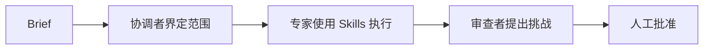
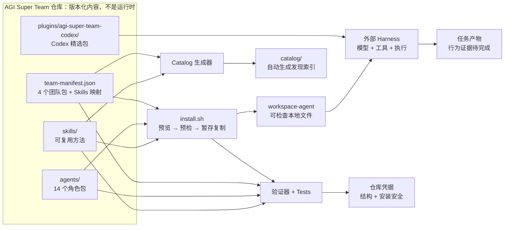

<p align="right"><a href="./README.md">English</a></p>

<p align="center">
  
</p>

<h1 align="center">AGI Super Team</h1>

<p align="center"><strong>可组合 Skills。专业 Agents。可审查的团队 Workflows。</strong></p>

<p align="center">
  用一份 Brief 组织范围明确的工作、专业任务、独立审查和清晰的人工批准门禁。
</p>

AGI Super Team 是一个面向 Codex 和本地编程 Agent 工作区的版本化资源库，提供 **AI Agent Skills、专业角色包和 human-in-the-loop 团队 Workflows**。

## 安装到你的 AI 客户端

先列出全部 18 个适配目标，再预览一个目标，确认后用同一选择安装：

```bash
npx -y github:aAAaqwq/AGI-Super-Team --list-tools
npx -y github:aAAaqwq/AGI-Super-Team --tool claude-code
npx -y github:aAAaqwq/AGI-Super-Team --tool claude-code --install
npx -y github:aAAaqwq/AGI-Super-Team --tool claude-code --doctor
```

把 `claude-code` 换成 `--list-tools` 输出的目标 ID。只有在确实要同时写入全部全局和项目适配目标时，才使用 `--all-tools`。不带参数仍保留旧版 Codex 预览行为；新脚本应明确写出 `--tool` 或 `--all-tools`。

### 四个平台优先入口

| 平台 | 预览命令 | 安装能力 |
|---|---|---|
| **Claude Code** | `npx -y github:aAAaqwq/AGI-Super-Team --tool claude-code` | 原生 Markdown Agent + 原生 Skill |
| **Codex** | `npx -y github:aAAaqwq/AGI-Super-Team --tool codex` | 原生 TOML Agent + Codex Plugin Skill；当前有 Runtime 验证的适配器 |
| **OpenClaw** | `npx -y github:aAAaqwq/AGI-Super-Team --tool openclaw` | 原生 Agent Workspace + 原生 Skill |
| **Hermes Agent** | `npx -y github:aAAaqwq/AGI-Super-Team --tool hermes` | 原生 Skill；角色包以 Skill 暴露，不是原生 Agent |

对 OpenClaw，安装器只生成 Agent Workspace，不会自动注册；请先审查内容，再显式注册需要的 Workspace。

这里列出的是 **18 个 AI 客户端/运行时适配目标**，不是 18 个功能相同的 CLI。适配器可能安装原生 Agent、原生 Skill、项目规则/上下文，或把角色包降级为 Agent-as-Skill。文件写入成功不等于当前客户端已经加载或执行这些内容。

### 18 个适配目标矩阵

全局适配器的路径相对于所选 Home；项目适配器的路径相对于所选项目目录。

| ID | 客户端/运行时 | 范围 | Agent 交付方式 | Skill 交付方式 | 状态 |
|---|---|---|---|---|---|
| `claude-code` | Claude Code | 全局 | 原生 Markdown Agent：`.claude/agents` | 原生：`.claude/skills` | 原生适配 |
| `codex` | Codex | 全局 | 原生 TOML Agent：`.codex/agents` | 原生 Plugin：`.codex/skills` | Runtime 已验证适配器 |
| `openclaw` | OpenClaw | 全局 | 原生 Workspace：`.openclaw/agency-agents` | 原生：`.openclaw/skills/agi-super-team` | 原生适配 |
| `hermes` | Hermes Agent | 全局 | Agent-as-Skill：`.hermes/skills/agi-super-team-agents` | 原生：`.hermes/skills/agi-super-team` | 原生 Skills |
| `copilot` | GitHub Copilot | 全局 | Markdown Agent：`.github/agents`、`.copilot/agents` | 原生：`.copilot/skills` | 适配器 |
| `antigravity` | Antigravity | 全局 | Agent：`.gemini/config/agents` | 原生：`.gemini/config/skills` | **实验性** |
| `gemini-cli` | Gemini CLI | 全局 | Markdown Agent：`.gemini/agents` | 原生：`.gemini/skills` | 适配器 |
| `opencode` | OpenCode | 全局 | Markdown Agent：`.config/opencode/agents` | 原生：`.config/opencode/skills` | 适配器 |
| `cursor` | Cursor | 全局 | Markdown Agent：`.cursor/agents` | 原生：`.cursor/skills` | **实验性** |
| `trae` | Trae | 项目 | 项目规则：`.trae/rules` | 原生：`.trae/skills` | 项目适配器 |
| `aider` | Aider | 项目 | 合并项目规则：`CONVENTIONS.md` | 合并进同一项目上下文 | 项目适配器 |
| `windsurf` | Windsurf | 项目 | 合并项目规则：`.windsurfrules` | 合并进同一项目上下文 | 项目适配器 |
| `qwen` | Qwen Code | 全局 | Markdown Agent：`.qwen/agents` | 原生：`.qwen/skills` | 适配器 |
| `deerflow` | DeerFlow | 项目 | Agent-as-Skill：`skills/custom/agi-super-team-agents` | 原生：`skills/custom/agi-super-team` | 项目适配器 |
| `workbuddy` | WorkBuddy | 全局 | Agent-as-Skill：`.workbuddy/skills/agi-super-team-agents` | 原生：`.workbuddy/skills/agi-super-team` | 适配器 |
| `codewhale` | CodeWhale | 全局 | Agent-as-Skill：`.codewhale/skills/agi-super-team-agents` | 原生：`.codewhale/skills/agi-super-team` | 适配器 |
| `kiro` | Kiro | 全局 | Markdown Agent：`.kiro/agents` | 原生：`.kiro/skills` | 适配器 |
| `qoder` | Qoder | 全局 | Markdown Agent：`.qoder/agents` | 原生：`.qoder/skills` | 适配器 |

矩阵描述的是 [`config/cli-adapters.json`](./config/cli-adapters.json) 中的适配契约，并不表示 18 个客户端都做过运行时验证。Cursor 与 Antigravity 明确处于实验状态。

### 指定目录、刷新与验证

`--home` 用于重定向全局目标，`--project-dir` 用于项目范围目标（默认是当前目录）。可用临时目录完成一次隔离审计：

```bash
AGI_AUDIT_HOME="$(mktemp -d "${TMPDIR:-/tmp}/agi-super-team-home.XXXXXX")"
AGI_AUDIT_PROJECT="$(mktemp -d "${TMPDIR:-/tmp}/agi-super-team-project.XXXXXX")"

npx -y github:aAAaqwq/AGI-Super-Team --tool openclaw \
  --home "$AGI_AUDIT_HOME" --project-dir "$AGI_AUDIT_PROJECT"
npx -y github:aAAaqwq/AGI-Super-Team --tool openclaw \
  --home "$AGI_AUDIT_HOME" --project-dir "$AGI_AUDIT_PROJECT" --install
npx -y github:aAAaqwq/AGI-Super-Team --tool openclaw \
  --home "$AGI_AUDIT_HOME" --project-dir "$AGI_AUDIT_PROJECT" --doctor
```

以后用同一条 `--install` 命令刷新受管理内容，再运行一次 `--doctor`。随后重启目标客户端或新建任务，确认它发现了预期 Agent/Skill。`--doctor` 检查的是已安装的适配产物，不验证模型行为或任务质量。

### 安全与更新边界

- 默认只预览且不写文件；`--install` 是明确的写入边界。
- 对相同选择重复执行按幂等设计。不同的受管理目标会先备份再替换；选择范围外的客户端文件不归安装器管理。
- 本地备份只用于辅助恢复，不是完整快照或卸载系统。重要配置仍应纳入自己的版本控制或文件系统备份。
- 安装器拒绝符号链接等不安全目标；需要缩小范围时可使用 `--no-agents` 或 `--no-skills`。
- 本项目不提供远程脚本管道安装方式；上方命令使用 npm package runner，但仍应按常规审查依赖。
- 安装只证明文件已生成。除明确标为 Runtime 已验证的适配器外，当前客户端是否加载和执行仍需与 commit 匹配的凭据支持。

适配器设计部分参考了 [`jnMetaCode/agency-agents-zh`](https://github.com/jnMetaCode/agency-agents-zh) 的固定提交 [`2ecfabf8`](https://github.com/jnMetaCode/agency-agents-zh/commit/2ecfabf8e944ccdfed63ad8c44d5241290af6977)。AGI Super Team 在本仓库独立维护 Manifest、Payload 映射、安全行为和证据边界。

<p align="center">
  <a href="#安装到你的-ai-客户端"><strong>安装到一个客户端</strong></a>&nbsp;&nbsp;|&nbsp;&nbsp;
  <a href="./.codex/INDEX.md">查看 Codex 包</a>
</p>

## 🧠 一分钟理解整个系统

| 层级 | 你会得到什么 | 为什么有用 |
|---|---|---|
| **🧩 Skills** | 按 14 类成果组织的权威实体 `SKILL.md` | 为重复任务复用聚焦方法，不必每次重写指令 |
| **🤖 Agents** | 14 个可检查的角色包，包含人格、工作流和工具指南 | 让规划、工程、内容、研究和审查拥有明确负责人 |
| **🔁 Team Packs** | 8 个由 manifest 驱动的成果型 Team，覆盖 Solo Founder 到 Full Team | 围绕成果启用最小充分团队，而不是一开始加载全部角色 |

<p>
  <a href="https://github.com/aAAaqwq/AGI-Super-Team/actions/workflows/validate-repository.yml"></a>
  <a href="./LICENSE"></a>
  
</p>

这些团队包围绕以下审查闭环设计：



AGI Super Team 负责版本化内容、选择规则、安全复制和仓库检查。你另行配置的编程 Agent 工具负责模型、凭据、工具、执行和最终任务产物。

## 🎯 从一个成果开始

| Starter Kit | 提供给它 | 预期评估产物 | 团队 |
|---|---|---|---|
| [🚀 Solo Founder](./starter-kits/solo-founder/) | 产品或发布 Brief | 决策备忘录、测试优先实施计划、发布文案草稿 | CEO、PE、CCO |
| [✍️ Content Creator](./starter-kits/content-creator/) | 素材与目标受众 | 调研笔记、内容草稿、衡量计划 | CCO、CDO、CMO |
| [📊 Quant Research](./starter-kits/quant-trader/) | 研究问题与历史数据 | 研究备忘录、回测计划、风险审查；绝不执行实盘交易 | CQO、CDO、CFO |

确实需要更广覆盖时，`full-team` 会选择 manifest 中全部 14 个 Agents。一般情况下建议先从聚焦团队开始。

## ⚡ 旧版通用工作区生成器

上方多客户端 npm 安装器是主要入口。需要与具体客户端无关、可直接检查的角色工作区时，旧版 `install.sh` 仍然有用。克隆 `main` 并预览 Solo Founder；默认只预览，不会写入文件：

```bash
git clone --depth 1 --branch main https://github.com/aAAaqwq/AGI-Super-Team.git
cd AGI-Super-Team
git rev-parse HEAD
./install.sh --source "$PWD" --destination /path/to/review-workspace solo-founder
```

检查所选 Agents 和目标位置，确认符合预期后再应用：

```bash
./install.sh --source "$PWD" --destination /path/to/review-workspace --apply solo-founder
```

通用安装器会在发布暂存工作区前验证全部必需文件。它会保留已有的人格和技能文件，并拒绝危险的来源或目标符号链接。依赖、更新和恢复方法见 [setup.md](./setup.md)。

Manifest 会把可移植的 `required`/`optional` Skills、仅适用于特定 Harness 的 `harnessSpecific` 目录项，以及未内置的外部推荐明确分开。通用安装只复制通过当前 portability contract 的类别，并扫描完整 payload 中已知的宿主路径与运行时专用命令。

**成功标准：** 预览不写入任何文件；应用会创建三个可检查的角色工作区，并且不覆盖已有文件。

## 🧭 按成果浏览技能

根 README 只保留精选入口。需要完整、可检索库存时，请使用自动生成的 catalog。

| 构建与运行 | 获客与创作 | 决策与自动化 |
|---|---|---|
| [🤖 AI Agents 与编排](./catalog/#ai-agents-orchestration) | [📈 营销、SEO 与增长](./catalog/#marketing-seo-growth) | [📊 数据、分析与研究](./catalog/#data-analytics-research) |
| [💻 软件工程](./catalog/#software-engineering) | [✍️ 内容、媒体与发布](./catalog/#content-media-publishing) | [🧭 业务运营与战略](./catalog/#business-operations-strategy) |
| [☁️ 云、DevOps 与可靠性](./catalog/#cloud-devops-reliability) | [🤝 销售、CRM 与客户成功](./catalog/#sales-crm-customer-success) | [⚙️ 应用与工作流自动化](./catalog/#apps-workflow-automation) |
| [🛡️ 安全、隐私与法律](./catalog/#security-privacy-legal) | [🎨 产品、设计与 UX](./catalog/#product-design-ux) | [💹 金融、交易与市场](./catalog/#finance-trading-markets) |
| [🧰 专业领域与通用工具](./catalog/#general-utilities) | [🇨🇳 中文平台工作流](./catalog/#chinese-platform-workflows) | |

按所需深度继续探索：

| 入口 | 最适合 |
|---|---|
| [Skills 概览](./skills/) | 支持等级、范围明确的起点和发现方式 |
| [自动生成的技能目录](./catalog/) | 按任务成果组织全部权威实体技能 |
| [Agents](./agents/) | 人格、身份、工作流和工具指南 |
| [实用指南](./docs/guides/) | Codex、Claude Code、兼容性、团队选择和工作边界 |
| [专题手册](./cookbook/) | 内容、提示词、研究和量化工作流的深入材料 |
| [架构地图](./ARCHITECTURE.md) | 事实来源、生成产物、公开入口和变更责任 |
| [统一术语](./CONTEXT.md) | Module、Interface、Adapter、证据与产品术语 |

### 🔎 查找高质量 Skill 来源

[`agent-skill-repository-index`](./skills/agent-skill-repository-index/) 把 Daniel 审核过的来源清单变成安全选择流程。先比较一个候选项并检查权限和来源，再安装或移除它，而不是全局激活整个仓库。

| 需求 | 维护中的参考资料 |
|---|---|
| 比较审核来源 | [来源矩阵](./skills/agent-skill-repository-index/references/repositories.md) |
| 检查带日期的热度信号 | [Star 快照](./skills/agent-skill-repository-index/references/star-snapshot.md) |
| 安全安装单个候选项 | [安装流程](./skills/agent-skill-repository-index/references/installing.md) |

Star 只用于发现，不等于可信。矩阵记录 `DAILY`、`LIBRARY` 和 `QUARANTINE` 边界；聚合目录和运行时不会被批量安装。

## ✅ 今天已经实用的部分

你已经可以浏览确定性技能目录、检查每个 Agent 指令、预览 manifest 选择的团队，并在不覆盖已有文件的前提下组装本地角色工作区。

| 主张 | 证据 | 状态 |
|---|---|---|
| 仓库库存、数量和引用 | `npm run validate -- --warnings-as-errors` | **当前 checkout 已验证** |
| 通用安装器的预览、预检、no-clobber 和暂存 | `npm test` | **当前 checkout 已验证** |
| 自动生成目录覆盖权威库存 | `npm run check:skills` | **当前 checkout 已验证** |
| 主成果分类与固定独立复核集一致 | [Gold Set 方法](./docs/skill-taxonomy-gold-set.md) + [生成报告](./catalog/skill-taxonomy-evaluation.json) | **当前 checkout 的复核集门禁已通过** |
| 尚无匹配凭据的适配器在客户端中的加载 | 与版本匹配的 Harness Receipt | **Validation pending** |
| 任务质量或商业成果 | 公开 fixture、基线、评估规则和产物 | **Validation pending** |

## 🧾 可复现安装凭据

创建一次性目标目录，证明预览没有写入，再应用并验证 Solo Founder 的三个预期工作区：

```bash
AGI_SOLO_DEST="$(mktemp -d "${TMPDIR:-/tmp}/agi-solo-founder.XXXXXX")"

./install.sh --source "$PWD" --destination "$AGI_SOLO_DEST" solo-founder
test -z "$(find "$AGI_SOLO_DEST" -mindepth 1 -print -quit)"

./install.sh --source "$PWD" --destination "$AGI_SOLO_DEST" --apply solo-founder
test -f "$AGI_SOLO_DEST/workspace-ceo/SOUL.md"
test -f "$AGI_SOLO_DEST/workspace-pe/SOUL.md"
test -f "$AGI_SOLO_DEST/workspace-cco/SOUL.md"

python3 -m venv .venv
. .venv/bin/activate
python -m pip install --requirement requirements-dev.txt
npm test
npm run validate -- --warnings-as-errors
npm run check:skills
npm run check:taxonomy-evaluation
npm run check:architecture
```

这份凭据证明当前 checkout 和目标状态下的 manifest 选择、预览安全、暂存复制和仓库完整性。它不能证明工具加载、任务质量或商业成果。

<details>
<summary><strong>👀 查看 preview → apply → verify 分镜</strong></summary>

<p align="center">
  
</p>

动画使用脱敏路径，仅为演示 storyboard，不是运行证据。可阅读[分镜文字稿](./assets/demo-install.txt)。

</details>

如果 preview-first 流程对你有帮助，可以 [Star 本仓库](https://github.com/aAAaqwq/AGI-Super-Team)，方便以后找到这条经过验证的路径。

## 🔌 选择分发方式

为指定 AI 客户端/运行时安装时，使用上方的 [18 目标 npm 安装器](#安装到你的-ai-客户端)；需要 Codex 专用细节时查看 [Codex 精选包](./.codex/INDEX.md)；需要与客户端无关的文件时使用旧版通用工作区生成器。[Claude Code 指南](./docs/guides/claude-code-install.html)与[客户端兼容说明](./docs/guides/harness-compatibility.html)提供补充背景，但支持状态以当前适配 Manifest 和与 commit 匹配的凭据为准。

通用路径需要 Bash 与 Node.js；仓库验证还需要 npm 与 Python 3。操作系统和客户端版本支持范围以 CI 和已发布凭据为准。存在适配文件永远不代表功能完全一致。

## 🗂️ 仓库架构



| 文件或目录 | 职责 |
|---|---|
| [`config/team-manifest.json`](./config/team-manifest.json) | Agents、团队包，以及可移植、Harness 专用和外部 Skill assignment 的事实源 |
| [`config/repository-architecture.json`](./config/repository-architecture.json) | 机器可读的 Modules、路径责任、生成 lineage 与 Adapter 状态 |
| [`agents/`](./agents/) 与 [`skills/`](./skills/) | 人工编写、版本化输入；只有 manifest 标记为可移植的 payload 会进入通用工作区 |
| [`.codex/INDEX.md`](./.codex/INDEX.md) | 安装指南和 Codex 包索引 |
| [`plugins/agi-super-team-codex/`](./plugins/agi-super-team-codex/) | 实际的 Codex 插件、Skills 和内置 Agent 角色 |
| [`install.sh`](./install.sh) | 默认预览、选择、预检、暂存和 no-clobber 发布 |
| [`scripts/repository_model.py`](./scripts/repository_model.py) | 验证与生成共用的库存及 manifest 模型 |
| [`catalog/`](./catalog/) | 自动生成的发现输出，不是库存事实源 |
| [`tests/`](./tests/) | 仓库、安装器、站点数据和 SEO 契约 |
| [`docs/`](./docs/) | 项目站、验证数据和人工编辑指南 |

关于 authored input、generated output、分发和证据边界，请阅读完整的[仓库架构地图](./ARCHITECTURE.md)、[统一术语](./CONTEXT.md)与[决策记录](./docs/adr/)。

[`config/external-skill-sources.json`](./config/external-skill-sources.json) 记录已删除机器本地链接的 tombstones，其中也包括尚未解析的来源字段。README 文案和自动生成目录都不是库存事实源。

## 🧠 团队拓扑

```text
创始人 / 操作者
└── CEO：协调与质量门禁
    ├── CTO / PE：架构与实现
    ├── CPO / CCO / CMO：产品、内容与增长
    ├── CQO / CFO / CDO：量化研究、财务与数据
    ├── CLO / CRO / CSO / COO：法律、研究、销售与运营
    └── Governor：独立审查与升级
```

导师姓名只用于创作框架，不代表关联、背书或保证模仿效果。

## 🛡️ 边界与人工批准

AGI Super Team 不是模型、自治编排器或 Agent 运行时。安装文件不会让某个工具自动加载或执行它们。

- 执行前检查第三方命令和依赖。
- 不要在 Skill 或 issue 中放入凭据、私人数据、浏览器会话或生产配置。
- 金融工作流在独立验证前仅用于研究或模拟交易。
- 帖子、消息、交易、部署和破坏性操作必须经过人工明确批准。
- 安全漏洞请通过 [GitHub Security Advisories](https://github.com/aAAaqwq/AGI-Super-Team/security/advisories/new) 私密报告。

## 🤝 贡献与求助

- [提交可复现 Issue](https://github.com/aAAaqwq/AGI-Super-Team/issues/new/choose)
- [贡献与来源要求](./CONTRIBUTING.md)
- [安装与恢复](./setup.md)
- [安全政策](./SECURITY.md)
- [增长手册](./growth/README.md)
- [MIT 许可证](./LICENSE)

## ⭐ GitHub Stars

查看 AGI Super Team 的公开增长趋势。动态图由 Star History 提供；点击图表可打开交互式时间线。

<p align="center">
  <a href="https://www.star-history.com/?type=date&amp;legend=top-left&amp;repos=aAAaqwq%2FAGI-Super-Team">
    
  </a>
  <br>
  <sub>动态图由 Star History 提供 · <a href="https://github.com/aAAaqwq/AGI-Super-Team/stargazers">在 GitHub 查看 Stargazers</a></sub>
</p>
