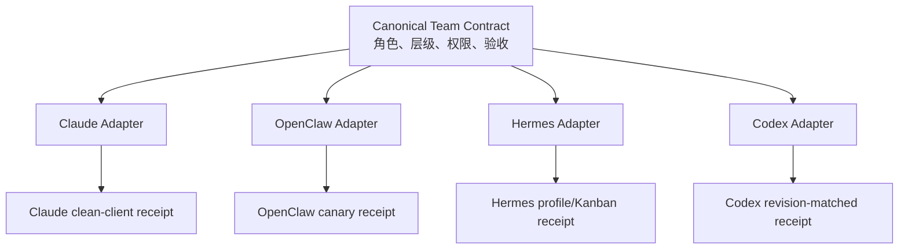

# 四个主力框架 Adapter 接入手册

AGI Super Team 只有一份 canonical Team Contract：`agents/` 定义角色与层级，`skills/` 定义可复用方法，Manifest 定义分配关系。Claude Code、Codex、OpenClaw、Hermes 的外置 Adapter 只负责翻译和安装，不反向修改 canonical 内容。

Team 如何选择 C-suite、Manager 如何限制直属专家，以及 Skills 为什么不是 Subagent 的自动继承链，见 [Team、C-suite、Subagent 与 Skill 的连接原理](./team-agent-skill-architecture.md)。



## 统一安装流程

先预览，再安装；只有需要写入框架配置或生成接线凭据时才加 `--connect`：

```bash
npx -y github:aAAaqwq/AGI-Super-Team --tool claude-code --all-subagents
npx -y github:aAAaqwq/AGI-Super-Team --tool claude-code --all-subagents --install --connect
npx -y github:aAAaqwq/AGI-Super-Team --tool claude-code --all-subagents --doctor
```

把 `claude-code` 换成 `codex`、`openclaw` 或 `hermes`。默认只安装 14 个 canonical 角色；`--with-subagents <高管>` 安装一组直属专家，`--all-subagents` 安装全部 92 个专家。

`--connect` 必须和 `--install` 同时使用。安装器会把不同的受管理目标先备份再替换，拒绝符号链接目标。它不会删除选择范围外的 Agent/Skill。

## Adapter 落盘与接线

| 框架 | Agent/角色产物 | canonical Skills | 接线行为 |
|---|---|---|---|
| Claude Code | `~/.claude/agents/ast-*.md` | `~/.claude/skills/<skill>` | 文件系统发现；生成 Claude `Agent` 工具专用 orchestrator |
| Codex | `~/.codex/AGENTS.md` 受管理 CEO 块 + `~/.codex/agents/ast-*.toml` | `~/.codex/skills/<skill>` | 当前主会话是 CEO，不生成第二个 CEO Agent；其余角色使用 TOML |
| OpenClaw | `~/.openclaw/agency-agents/agi-super-team/ast-*` | `~/.openclaw/skills/agi-super-team/<skill>` | `--connect` 先 dry-run，再按 `id` 合并 `agents.list`，保留非托管 Agent，不创建 channel binding |
| Hermes | `~/.hermes/skills/agi-super-team-agents/ast-*/SKILL.md` + Profile 蓝图 | `~/.hermes/skills/agi-super-team/<skill>` | 生成 Profiles + Kanban 蓝图；不自动创建 Profile、Cron 或 Gateway |

所有物理存在且已分配的 canonical Skills 均按字节复制。Agent 由目标 Adapter 按框架原生格式生成；canonical `agents/` 与 `skills/` 不会被改写。

## 权限和委派边界

- 统一层级为 CEO → C-suite Manager → Leaf，最大深度为 2。
- 每个 Manager 最多两个并发直属叶子。
- Leaf 与 Governor 不得继续委派。
- Governor 独立复核，不能被工作 Agent 的结果替代。
- OpenClaw 的复核任务必须携带原始 `childSessionKey`；Governor 必须自行调用 `sessions_history` 读取该子会话，不能只依赖 CEO 转述或完成通知。
- OpenClaw 的 `requireAgentId` 只写入 `ast-*` 托管角色，不改变已有非托管 Agent 的全局行为。
- OpenClaw 不自动创建外部消息绑定；Hermes 不自动启动长期运行控制面。
- 登录、发布、部署、凭证、资金、法律承诺和不可逆操作仍需人类批准。

## Connection 与 Receipt

每个 Adapter 都会安装：

```text
~/.<framework>/agi-super-team/connection.json
```

`--connect` 还会生成：

```text
~/.<framework>/agi-super-team/receipt.json
```

Receipt 记录 package 版本、源 revision、工作树是否干净、connection SHA-256 和已执行检查。文件落盘或配置校验通过只代表结构接线成功，`runtimeEvidence` 仍保持 `pending`。只有 clean client 中真实观察到语义触发、CEO→Manager→Leaf 委派和独立 Governor 复核，并把证据绑定到干净的仓库 revision，才能升级运行证据。

四类目标凭据分别是：

- Claude Code：clean `CLAUDE_CONFIG_DIR` 发现、触发和委派凭据。
- Codex：绑定干净 source revision 与 connection digest 的凭据；当前主会话继续承担 CEO。
- OpenClaw：隔离 state、配置校验、Agent 发现、委派、Governor 与 bindings 未改变的 canary。
- Hermes：真实 Profile roster、角色 Skill 固定装载、Kanban 依赖链和独立 Governor Profile 的凭据。

如果源工作树是 dirty、客户端缺失，或没有执行模型 canary，Receipt 会明确保留 `pending`；不得把文件存在当作运行时验证。
