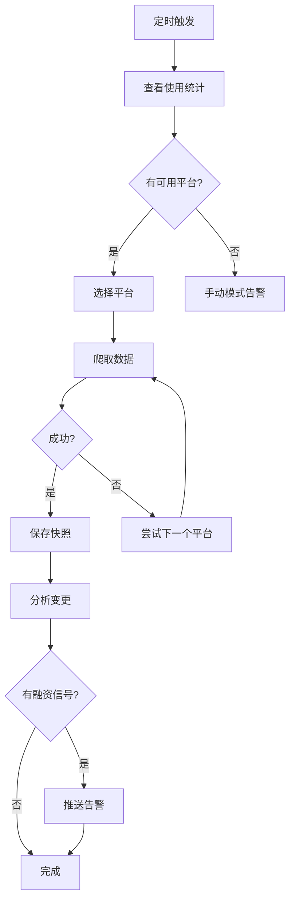

# 免费多平台轮换爬虫 - 使用指南

## 🎯 核心策略

在**天眼查、企查查、爱企查、国家公示系统**之间智能轮换，最大化免费额度。

## 📊 每日免费额度

| 平台 | 免费额度 | 延迟 | 优势 |
|------|---------|------|------|
| 天眼查 | 20 次 | 3-8 秒 | 数据最全 |
| 企查查 | 10 次 | 5-12 秒 | 股东信息详细 |
| 爱企查 | 50 次 | 2-6 秒 | 限制最少 |
| 国家公示系统 | 无限 | 3-10 秒 | 官方权威 |

**每日总计**: ~80+ 次免费查询

---

## 🚀 快速开始

### 1. 查看使用统计

```bash
cd ~/clawd/skills/healthcare-monitor/scripts
python3 scraper_free.py status
```

**输出示例**:
```
📊 **今日使用统计** (2026-02-03)

🟢 **天眼查**: 0/20 已用 (20 次剩余)
🟢 **企查查**: 0/10 已用 (10 次剩余)
🟢 **爱企查**: 0/50 已用 (50 次剩余)
🟢 **国家企业信用信息公示系统**: 0/999 已用 (999 次剩余)
```

### 2. 采集企业信息

```bash
python3 scraper_free.py scrape "迈瑞医疗"
```

**成功示例**:
```json
{
  "success": true,
  "source": "天眼查",
  "platform_used": "tianyancha",
  "data": {
    "name": "迈瑞医疗",
    "legal_representative": "李西廷",
    "capital": "12.14亿",
    "capital_amount": 1214000000,
    "shareholders": [...]
  }
}
```

**失败示例**（自动回退到手动）:
```json
{
  "success": false,
  "error": "需要手动采集",
  "manual_instructions": {
    "platforms": [
      {"name": "天眼查", "url": "https://...", "priority": 1},
      {"name": "企查查", "url": "https://...", "priority": 2}
    ],
    "fields_to_collect": ["公司全称", "法定代表人", "注册资本", ...]
  }
}
```

---

## 🔄 轮换逻辑

### 自动选择算法

```python
1. 获取所有可用平台（未超限的）
2. 按使用次数排序（优先使用未使用的）
3. 依次尝试：
   - 天眼查 → 企查查 → 爱企查 → 国家公示系统
4. 如果全部失败 → 返回手动指南
```

### 延迟策略

| 平台 | 延迟范围 | 原因 |
|------|---------|------|
| 天眼查 | 3-8 秒 | 中等限制 |
| 企查查 | 5-12 秒 | 限制较严 |
| 爱企查 | 2-6 秒 | 百度系，限制较松 |
| 国家公示系统 | 3-10 秒 | 官方系统 |

---

## 📦 安装 Playwright（推荐）

### 当前状态
- ⚠️ Playwright 未安装 - 手动模式
- ✅ 安装后 - 自动采集

### 安装步骤

```bash
# 安装 Playwright
pip install playwright

# 安装浏览器
playwright install chromium

# 验证安装
python3 -c "from playwright.sync_api import sync_playwright; print('✅ 安装成功')"
```

### 安装后的好处

- ✅ 自动采集，无需手动
- ✅ 智能绕过简单验证码
- ✅ 处理 JavaScript 渲染页面
- ✅ 模拟真实用户行为

---

## 🛠️ 工作流程

### 完整监控流程



### 监控命令

```bash
# 检查所有企业
python3 monitor.py check

# 检查单个企业
python3 monitor.py check "迈瑞医疗"

# 列出监控企业
python3 monitor.py list

# 添加企业
python3 monitor.py add "公司名"

# 移除企业
python3 monitor.py remove "公司名"
```

---

## 📈 使用统计

### 统计文件位置

```
~/clawd/skills/healthcare-monitor/data/usage_stats.json
```

### 数据结构

```json
{
  "date": "2026-02-03",
  "platforms": {
    "tianyancha": 5,
    "qichacha": 3,
    "aiqicha": 10,
    "gsxt": 2
  }
}
```

### 每日重置

- 统计在每日第一次查询时自动重置
- 确保 00:00 后第一次查询获得全部免费额度

---

## ⚠️ 限制和注意事项

### 平台限制

1. **天眼查**
   - IP 限制：频繁查询可能临时封禁
   - 验证码：出现后需手动处理
   - 建议：配合延迟使用

2. **企查查**
   - 需要登录才能查看详细信息
   - 免费额度最少（10 次）
   - 建议：作为备用平台

3. **爱企查**
   - 数据更新较慢
   - 历史数据较少
   - 建议：用于最新信息查询

4. **国家公示系统**
   - 搜索功能弱（需要精确名称）
   - 无历史变更记录
   - 建议：验证其他平台数据

### 最佳实践

```yaml
✅ 推荐做法:
  - 分散查询时间（避免集中查询）
  - 重点企业用天眼查（数据最全）
  - 一般企业用爱企查（额度多）
  - 每日首次查询前重置统计

❌ 避免做法:
  - 短时间内大量查询（可能被封）
  - 只用单一平台（浪费免费额度）
  - 忽略延迟设置（触发反爬）
```

---

## 🔧 配置调整

### 修改延迟

编辑 `config/settings.json`:

```json
{
  "scraper": {
    "delay_min": 5,    // 最小延迟（秒）
    "delay_max": 15    // 最大延迟（秒）
  }
}
```

### 修改平台优先级

编辑 `scripts/scraper_free.py` 中的 `PLATFORMS` 列表顺序。

---

## 🆘 故障排查

### 问题 1: 所有平台额度用完

**解决方案**:
1. 等待第二天重置
2. 使用手动模式补充
3. 考虑付费 API

### 问题 2: 频繁遇到验证码

**解决方案**:
1. 增加延迟时间
2. 减少查询频率
3. 更换 IP（如果有代理）

### 问题 3: 数据不准确

**解决方案**:
1. 使用国家公示系统验证
2. 多平台对比
3. 手动核实关键信息

---

## 📞 支持

- **文档**: `~/clawd/skills/healthcare-monitor/SKILL.md`
- **配置**: `~/clawd/skills/healthcare-monitor/config/`
- **日志**: `~/clawd/skills/healthcare-monitor/data/logs/`

---

**记住**: 免费方案需要耐心和合理规划！ 🎯
