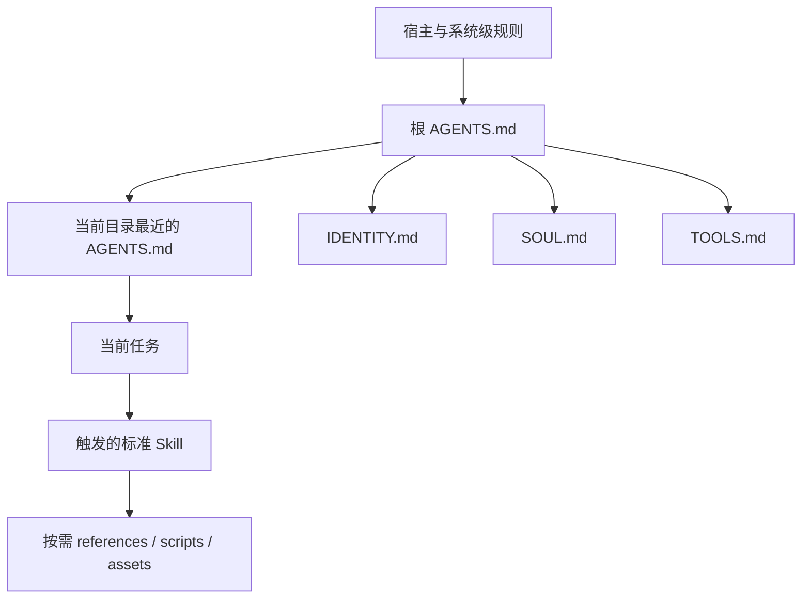

# Agent 套件架构规范

## 目录

1. 设计目标
2. 文件职责矩阵
3. 加载与作用域
4. 优先级与冲突处理
5. 推荐目录结构
6. 拆分与合并规则
7. 生命周期与维护

## 1. 设计目标

Agent 套件不是一组“看起来像提示词”的 Markdown，而是一套可加载、可继承、可审查、可验证的行为契约。设计必须同时满足：

- **可发现**：宿主确实会加载入口，或入口会明确路由到配套文件。
- **单一职责**：同一规则只有一个权威位置，其他文件只引用，不复制。
- **分层稳定**：高频且稳定的规则靠前；易变化的命令、平台事实和例子独立维护。
- **权限保守**：身份和人格不能自动授予工具权限，工具存在也不等于可以执行副作用。
- **证据可追溯**：能力、命令、平台、版本和安全声明能回到代码、测试或权威来源。
- **渐进披露**：默认上下文精简，执行具体任务时才加载详细参考。

## 2. 文件职责矩阵

| 文件 | 唯一职责 | 典型内容 | 不应承载 |
|---|---|---|---|
| `AGENTS.md` | 仓库或目录范围内的工作约束 | 作用域、编辑规则、安全、测试、Git、文档路由 | 长篇人格、完整命令手册、营销话术 |
| `AGENT.md` | 已确认宿主需要时的兼容入口 | 指向 `AGENTS.md` 的简短说明 | 复制一套独立规则 |
| `SKILL.md` | 可触发、可复用的专业工作流 | 触发描述、核心步骤、资源路由、交付标准 | 项目全部背景、未验证事实、无关教程 |
| `IDENTITY.md` | Agent 对外身份与能力边界 | 名称、角色、服务对象、使命、明确边界 | 命令参数、权限提升、频繁变化的版本号 |
| `SOUL.md` | 稳定人格、价值观和交流风格 | 原则、语气、决策倾向、禁忌 | 工具调用细节、业务状态机、授权规则 |
| `TOOLS.md` | 工具事实与操作契约 | 可用性、前置条件、读写属性、副作用、验证、回退 | 人格故事、夸张能力、密钥值 |
| `references/*.md` | 按需加载的详细知识 | API、平台变体、检查表、证据、长示例 | 必须每次都生效的安全规则 |
| `assets/` | 输出时复制或改造的材料 | 模板、样板、图标、脚手架 | 必须被 Agent 阅读后才能安全操作的规则 |
| `agents/openai.yaml` | Skill 的界面元数据 | 展示名、短描述、默认提示 | 执行逻辑、密钥、项目配置 |

辅助文件可按宿主使用，例如 `CLAUDE.md`、`.github/copilot-instructions.md` 或运行时配置。它们属于宿主适配层，不能未经确认就被当作跨平台标准。`README.md` 面向人类读者，也不应承担 Agent 必须遵守却无法保证加载的规则。

## 3. 加载与作用域

### 3.1 先确认发现机制

创建文件前回答：

1. 宿主自动寻找哪个文件名，是否区分单复数与大小写？
2. 搜索从哪里开始，是否向父目录查找？
3. 子目录中的指令是否只覆盖该子树？
4. 标准 Skill 从哪里安装，如何凭 `name + description` 触发？
5. 配套文件是否自动加载，还是必须由入口显式链接？
6. 生成或打包后这些文件是否仍存在于运行环境？

`IDENTITY.md`、`SOUL.md`、`TOOLS.md` 通常只是项目约定，并非通用自动发现协议。若产品要求每次会话读取它们，应在已确认可发现的入口中给出明确的读取顺序和使用条件。

### 3.2 推荐加载图



此图表达职责路由，不替代具体宿主的官方加载规则。运行时不支持的层必须通过已支持的入口接入。

### 3.3 嵌套作用域

- 根 `AGENTS.md` 放全仓通用规则。
- 只有子树确有不同技术、测试或安全约束时才新增嵌套 `AGENTS.md`。
- 子目录文件写“差异”，不复制根规则；明确其作用目录和覆盖点。
- 互相矛盾时，先判断宿主的真实优先级，再把冲突消除到文档层；不要依赖 Agent 猜测。
- 共享工作树、生成目录、vendor 目录通常不适合放重复指令。

## 4. 优先级与冲突处理

### 4.1 权威顺序

实际优先级由宿主决定。设计时至少遵守：

1. 系统、开发者和平台安全约束高于仓库文档。
2. 用户请求定义本次目标，但不能扩大未授权的副作用或绕过安全边界。
3. 已被宿主发现的仓库指令约束代码和文档工作。
4. 更窄的目录指令只在其作用域内细化更广规则。
5. Skill 提供任务工作流，不应反向覆盖更高层安全和仓库约束。
6. `SOUL.md` 的风格偏好不能覆盖事实、权限、用户明确语气或无障碍要求。

### 4.2 单一事实源

为每类规则指定权威文件：

| 规则类型 | 权威位置 | 其他文件的写法 |
|---|---|---|
| 仓库编辑与测试 | `AGENTS.md` | 链接到该规则，不复制 |
| 专业流程 | 对应 Skill | 只描述触发入口 |
| Agent 名称和角色 | `IDENTITY.md` | 引用一句定位 |
| 语气与价值观 | `SOUL.md` | 不在别处维护第二份禁忌表 |
| 工具命令与副作用 | `TOOLS.md` 或工具专属参考 | 只引用命令名 |
| 长期业务事实 | 产品/架构文档 | 套件记录来源和当前基线 |
| 易变平台事实 | 带日期的证据文档 | 执行前重新核验 |

### 4.3 冲突日志

审计时为每个冲突记录：`规则主题 / 文件A / 文件B / 实际证据 / 采用结论 / 修改位置 / 复核人或日期`。不得通过保留两种说法并写“视情况而定”来掩盖冲突。

## 5. 推荐目录结构

```text
repository/
├── AGENTS.md
├── IDENTITY.md
├── SOUL.md
├── TOOLS.md
├── docs/
│   └── agent/
│       ├── evidence.md
│       └── decisions.md
└── skills/
    └── verb-domain-task/
        ├── SKILL.md
        ├── agents/
        │   └── openai.yaml
        ├── references/
        ├── scripts/
        └── assets/
```

只有经确认的宿主要求时才增加根 `AGENT.md`。它应是兼容转发页，而不是另一套行为规范。

## 6. 拆分与合并规则

应拆分的信号：

- 一个文件同时回答“我是谁、怎么说、能用什么、如何执行”。
- 高频入口超过读者一次能快速审查的规模。
- 平台差异、API 字段或命令参数频繁变化。
- 同一长段落被三个以上流程引用。
- 某些内容只在特定任务中需要，却每次都被加载。

应合并或删除的信号：

- 两个文件维护同一规则的不同措辞。
- `AGENT.md` 与 `AGENTS.md` 内容几乎相同。
- `TOOLS.md` 只是另一份 README 命令清单，没有前置条件和验证契约。
- `SOUL.md` 与 `IDENTITY.md` 都在重复产品功能列表。
- references 只有几行且没有独立加载价值。

## 7. 生命周期与维护

- **负责人**：为套件和每个易变事实指定维护者。
- **基线**：记录审计的分支、提交、版本与日期。
- **触发复核**：平台迁移、工具升级、权限变化、命令改名、产品边界变化、事故复盘后必须复核。
- **变更顺序**：先修代码/测试或权威产品事实，再修 TOOLS/Skill，最后修身份与对外表达。
- **历史处理**：过时方案移入明确归档；活动入口不得继续把历史报告当当前承诺。
- **安装边界**：仓库中的 Skill 是版本化知识源，只有安装或显式指定后才应宣称运行时可自动触发。
